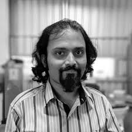
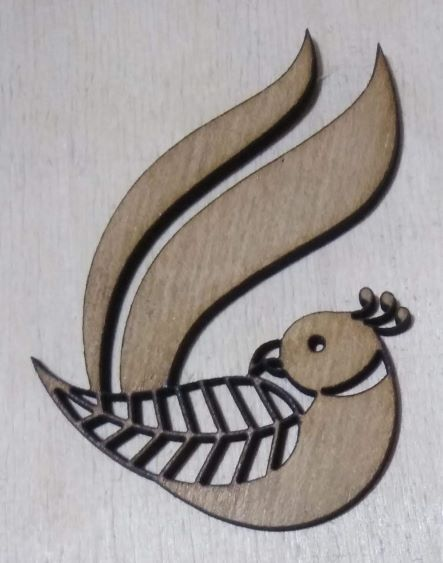
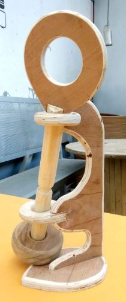
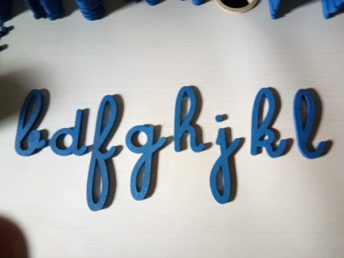

# About me

Hi! I am Richard Gomes. I am a Biohacker & Project Manager based in Bangalore working on operations and programs at Workbench Projects Pvt. Ltd.

This website is a documentation of my work as I go along.

## My background

Native to Bangalore, grown up in the Middle East and returned India to pursue a Bachelors in Industrial Biotechnology at Manipal Institute of Technology. I am interested in the hacking of machines and processes for personal benefit over the making of new ones from scratch (unless absolutely necessary).

## Previous work

I have worked on numerous projects in the past 2 years as a part of the operation of Fablab Bangalore starting from the apprentice of the ShopFloor Manager, working up my way to Digital Fabrication machines with 3D Printers, Laser Cutters, and CNC Routers within a short span of 30 days. Several random projects undertaken from the general public allowed a brief foray into basic electronics repair and testing. Suffice to say that in a span of 30 months, there has never been a single day when I did not learn a new topic.

### Projects

These are images of all the projects that the team have worked on in the past.

There are projects from each department, including from our Shopfloor, where we have a puzzle master

Montessori Letters

