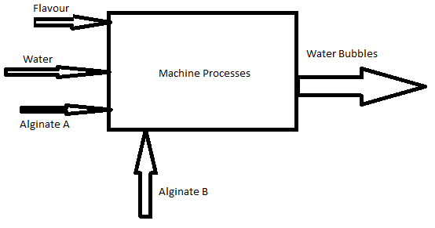

# 1. The Principles and Practices of Fab Academy

Goal(s)

- Introduction and past Lectures by Neil and briefings by Jim.
- Plan and sketch a potential final project.

## Introduction

Today we start the Fab Academy process and there was quite a bit of information imparted by my mentors Jim Seelan and Pradnya S. Given that I have been making projects and operating the Lab for the past 2 years, it looks like the course will focus on hardcore DIY over the kit-based plug and play method.

## Lectures (Summary)

Neil's Lecture 1 (2017) - Always complete assignments in time

Neil's Lecture 1 (2018) - Daily documentation is a must

Neil's Lecture 1 (2019) - Report all results including negative results

Briefing by Jim Seelan

- Always complete projects on time
- Report all results
- Do daily and detailed documentation

## Potential Final Project Sketch

From the varied ideas, the project that I selected is the one that will incorporate an element of all the modules that are being taught in Fab Academy.

The Water Bubble machine is a response to [this](http://www.skippingrockslab.com/) project that debuted with great fanfare in the UK for showcasing how packaging can be made using renewable and biodegradable materials and be made cost-effective on par with Plastic.

The final sketch is illustrated in a flowchart below for the understanding of the type of work involved

From the response expected in the media, we already have

- Multiple local restaurants
- Event organisers and
- Packaging manufacturers

Who want to adopt and incorporate this technology into their existing workflows and processes.

Since this is a large project, I plan to break it down into subsystems and achieve atleast one subsystem during this course

Processes expected to be used:

- Design, cutting and machining
- Machine Design
- 3D Printing
- Basic Electronic control

Approximate cost is expected to fall below $200 / INR 14,000/-

## Useful links

- [MarkDown](https://en.wikipedia.org/wiki/Markdown)
- [Water Bubble](http://www.skippingrockslab.com/)
- [Cutter](http://www.craftedge.com/download/)