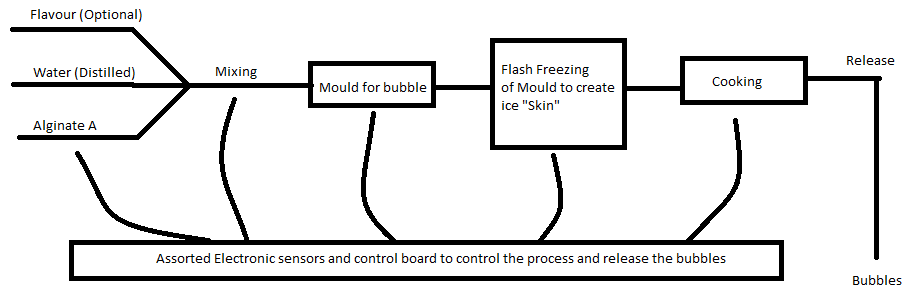
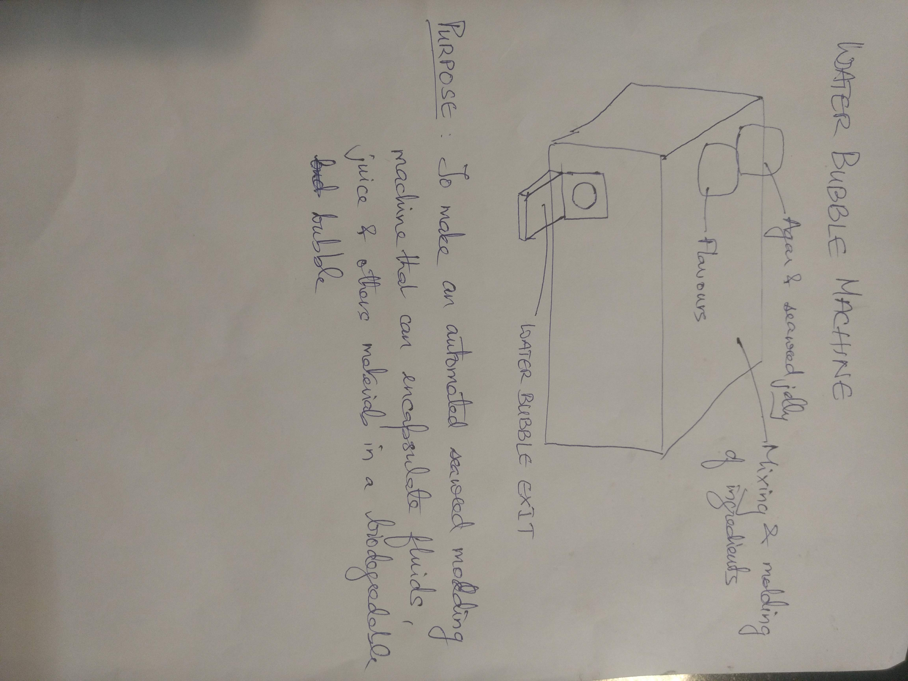
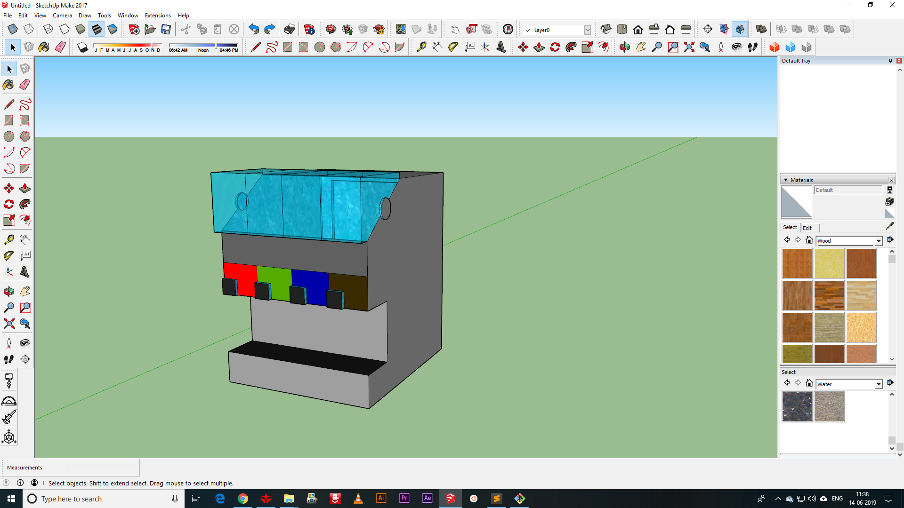

# 3. The Design Aids of Computers

Goal(s)

- To model (raster, vector, 2D, 3D, render, animate, simulate) a possible final project, and post it on the class page

## Facilities

This week, I took the time to make the model of the final project using Google Sketchup 2017 which we have in the Lab and has the greatest ease of use for a variety of projects.

The first step was to understand the mechanism of action in the Water Bubble Machine and accordingly design the elements virtually before animating and simulating the function.

For that we watch the following video

<iframe width="560" height="315" src="https://www.youtube.com/embed/sGlNhTjPBVU" frameborder="0" allow="accelerometer; autoplay; encrypted-media; gyroscope; picture-in-picture" allowfullscreen></iframe>

### Step 1 - Flowchart

As shown in the video, the flowchart of the operations required for the machine are detailed in this image and listed below.

The operations in use will be:

- Mixing
- Mould injection
- Flash Freezing
- Chemical Reaction

### Step 2 - Form Factor

The goal of this machine is to automate the process of creating Water Bubbles and dispensing them in a hassle free process so that they can be consumed by members of the public at multiple locations.

The machine needs to have a simple form factor that allows for:

- Ease of Transport
- Easy to clean and refill
- Simple to customize
- Produce 10 Bubbles per hour

The intial render is depicted here

### Step 3 - Final (tentative) design

The final design is expected to look like this and the following machine processes are foreseen for the creation of this prototype.

<iframe width="640" height="480" src="https://sketchfab.com/models/7287d80527c740ea8f48cdb32e77de90/embed" frameborder="0" allow="autoplay; fullscreen; vr" mozallowfullscreen="true" webkitallowfullscreen="true"></iframe>

    <a href="https://sketchfab.com/3d-models/machine-7287d80527c740ea8f48cdb32e77de90?utm_medium=embed&utm_source=website&utm_campaign=share-popup" target="_blank" style="font-weight: bold; color: #1CAAD9;">Machine</a>
    by <a href="https://sketchfab.com/gichardromes?utm_medium=embed&utm_source=website&utm_campaign=share-popup" target="_blank" style="font-weight: bold; color: #1CAAD9;">gichardromes</a>
    on <a href="https://sketchfab.com?utm_medium=embed&utm_source=website&utm_campaign=share-popup" target="_blank" style="font-weight: bold; color: #1CAAD9;">Sketchfab</a>

Processes expected

- Digital Fabrication and Design for the outer structure
- 3D Printing for the special parts
- Molding and Casting for the mould
- Electronics and Sensor control for the operations and processes
- PCB Design for custom control
- IP and Income from interested parties

## Useful links

- [Jekyll](http://jekyll.org)
- [Google](http://google.com)
- [Markdown](https://en.wikipedia.org/wiki/Markdown)