# 4. The Cutting of Computer controlled codes

Goal(s)

- Group assignment:
  - Characterize your lasercutter's focus, power, speed, rate, kerf, and joint clearance

- Individual assignment:
  - Cut something on the vinylcutter
  - Design, lasercut, and document a parametric press-fit construction kit (accounting for the lasercutter kerf, which can be assembled in multiple ways, and for extra credit include elements that aren't flat)

## Laser Cutter

In our lab, we have a Laser Spirit Pro with the following details:

Carbon dioxide(CO2) 60 Watt laser

Work area of 600mmx300mm. 

We use DXF and AI to cut profiles.

Engraving can also be done by varying the power.

I have experimented using cardboard, vinyl and MDF.

The pressfit assignment was done using MDF.

Engraving/Etching on MDF. 

Etching also on acrylic.

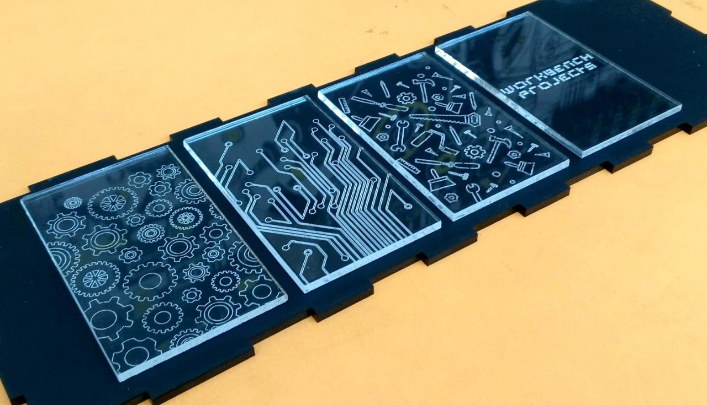

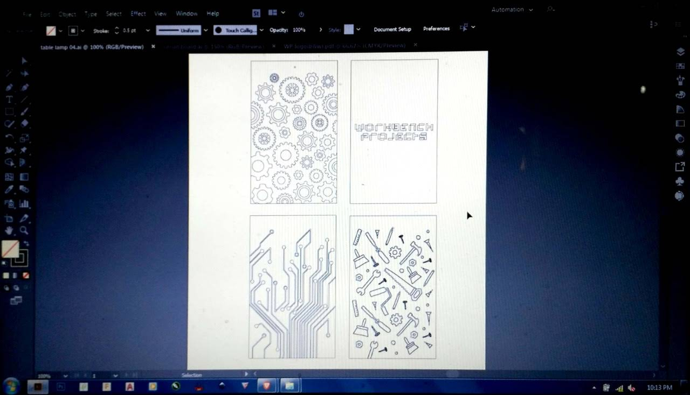

Focus: 10mm

Power: 25 Watt

## Kerf

Also we studied about Kerf which is important when we make press fit connections using slots.
The laser burns away a portion of material when it cuts through. This is known as the laser kerf and ranges from 0.08mm – 1mm depending on the material type and other conditional factors. Kerf is determined by material properties and thickness. But other factors also have an impact on how much the laser takes away like the focal length of the lens, pressure of compressed air both have an impact. Kerf widths can vary even on the same material sheet, whether cutting a straight line or a curve line or from laser cutting in the x or Y dimension. The manufacturing tolerance of the material can also impact the kerf. For some applications (for example a slot together product), we will need to account for the kerf within our drawing by adding or subtracting the kerf width from our component dimensions. With some experiments, we found that the kerf allowance that needs to be given for MDF in our lab is 0.08mm on each cut edge.

For Finding the Kerf of our machine we have made a kerf circle, which is having a small circle of 20mm OD and 10mm ID 

The Sketch of our circle is shown below.

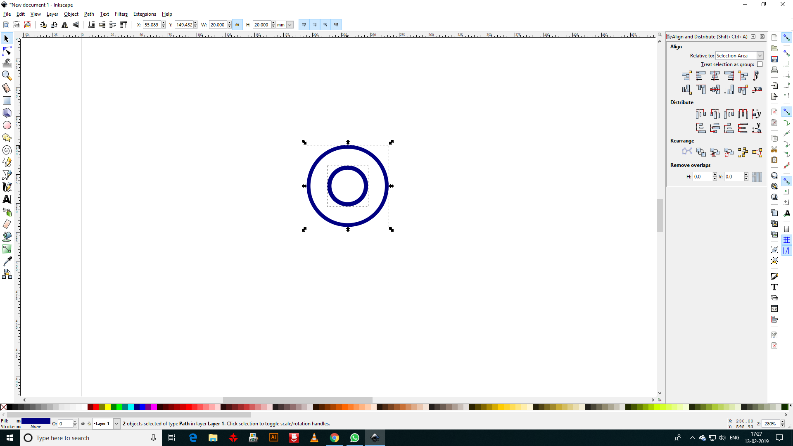

The calculated value of Kerf is 0.16/2= 0.08mm

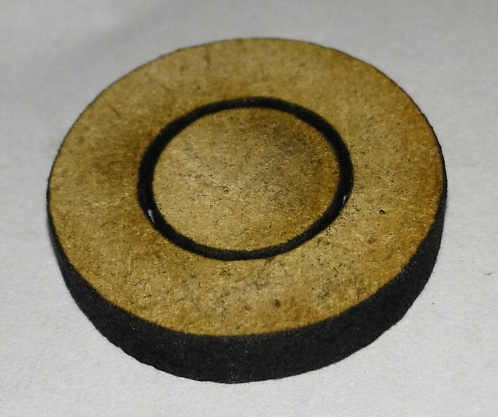

## Parametric Press Fit

For the Parametric press fit exercise, the documentation is of a smaller model of an interesting projects being done at the Shopfloor.

The basic design was made using Sketchup 2017 and exported as DXF for cutting out from 4mm MDF on the Laser Cutter to generate the first pair of the models

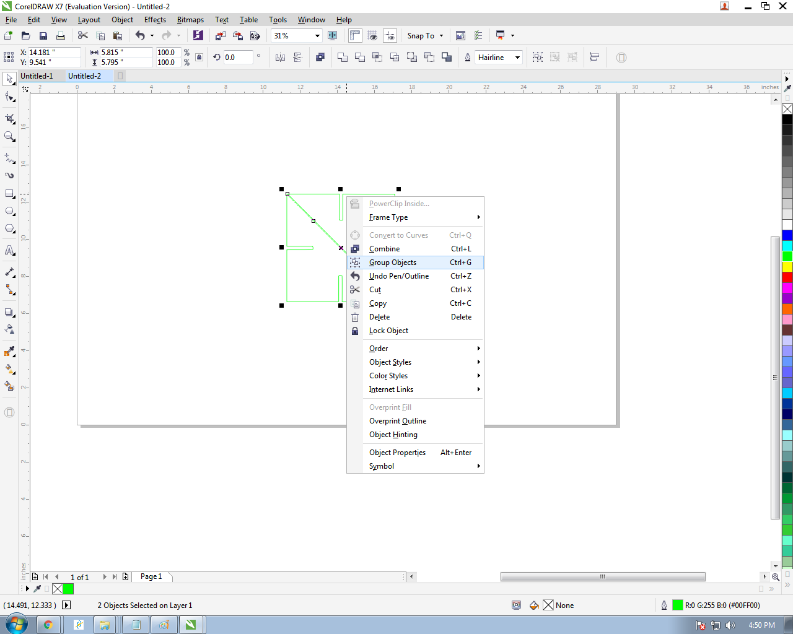

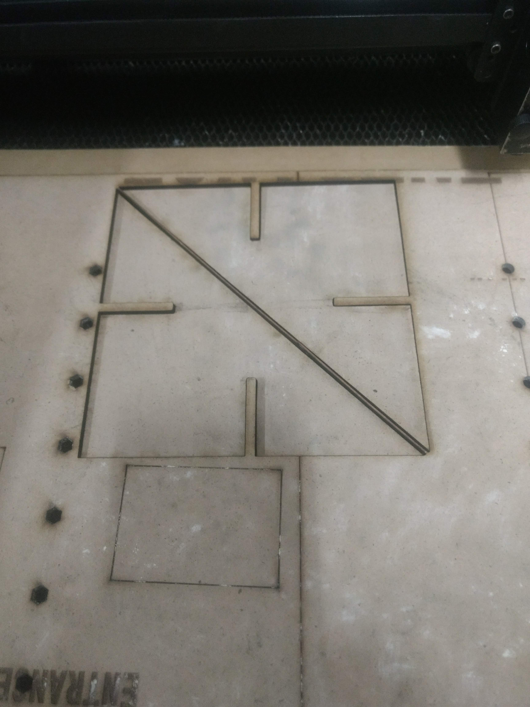

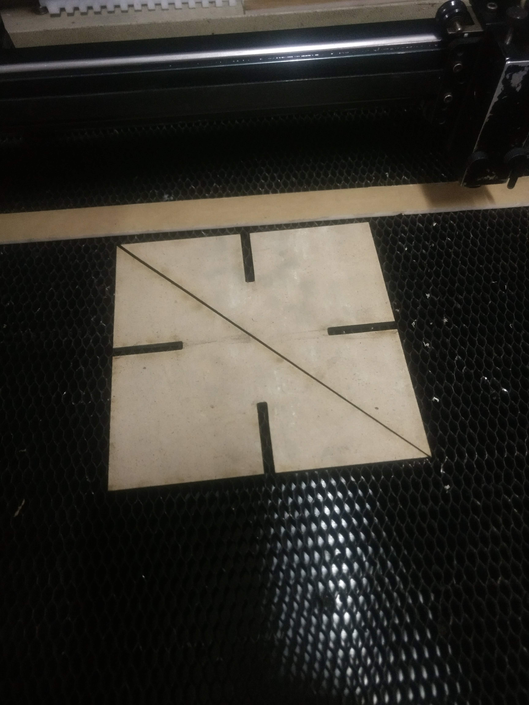

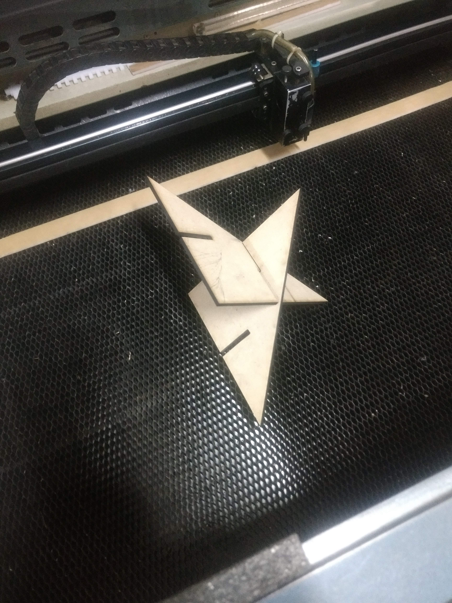

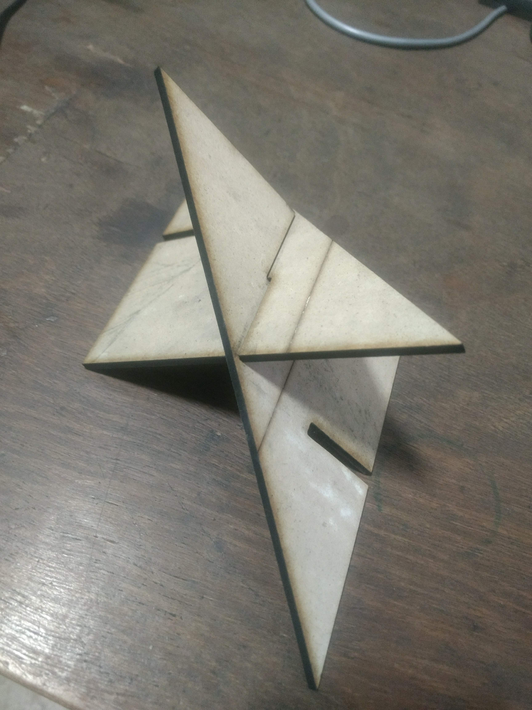

However, this is still a work in progress as there are still some kerf errors and press-fit challenges due to the nature of the material.

##Sticker Cutting

The Sticker cutting machine is down due to the age of the blade used for cutting. The blade is scheduled for replacement on Friday post-which this exercise can be completed

Update: The Vinyl Cutter got back online and the following design was cut out using Sticker Cutter Software

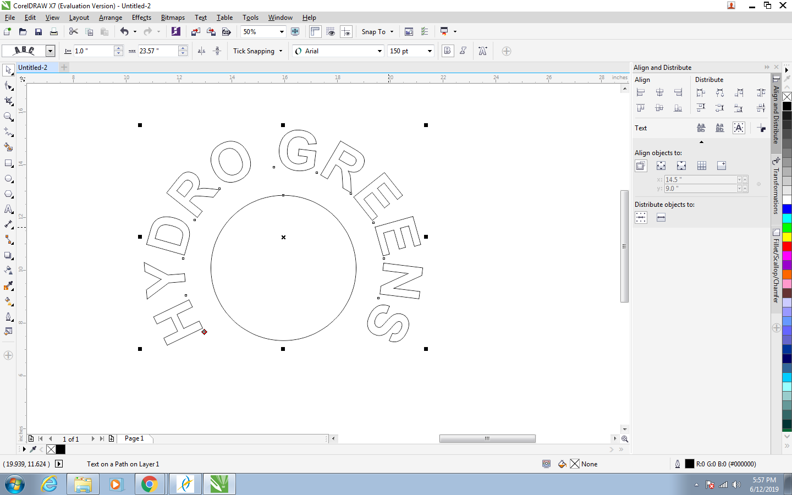

The Black Gloss Vinyl was loaded into the machine and the final result

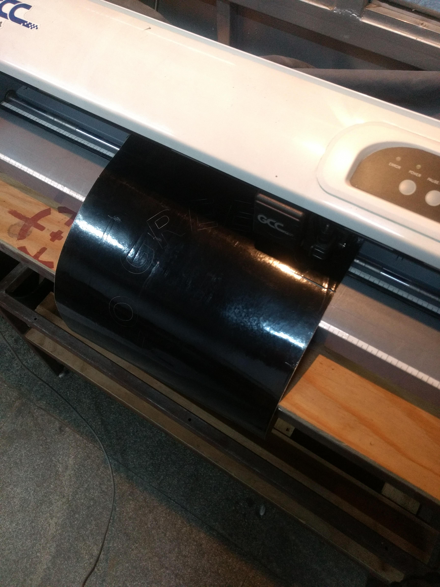

The Final result

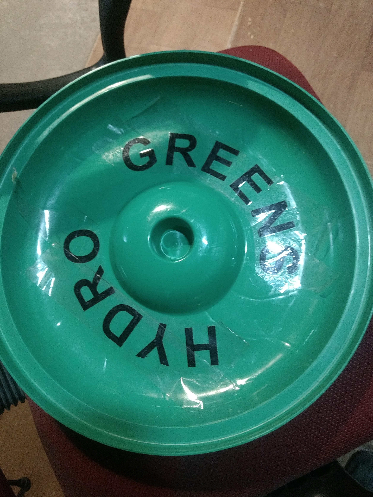

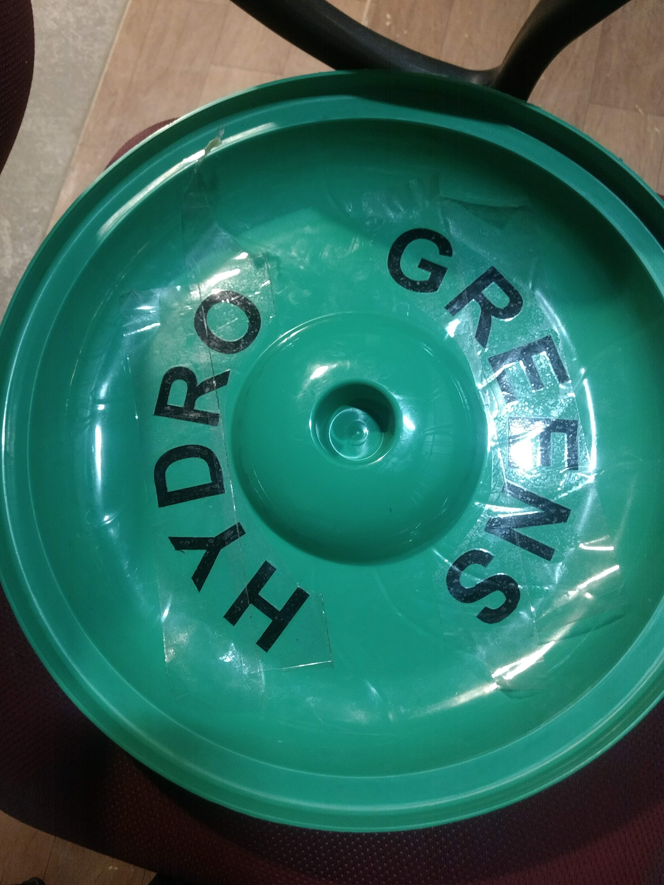