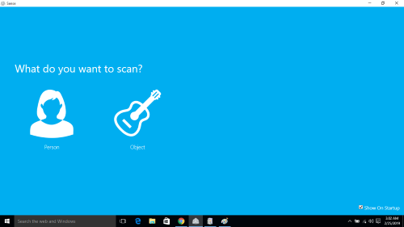

# 6. The Scanning and Printing of 3 Dimensions

 Goal(s):

- Group assignment:
  - test the design rules for your 3D printer(s)

- Individual assignment:
  - design and 3D print an object (small, few cm3, limited by printer time) that could not be made subtractively
  - 3D scan an object (and optionally print it)

## 3D Printer Design Rules

For the Characterisation of the 3D printer, the following 3D model from Thingiverse were downloaded and printed.

Model 1(https://www.thingiverse.com/thing:636363)

On conclusion, the rating of the machine was found to be good. The details of print versus model is as follows

## 3D Design

For the Design exercise, I selected a simple Gyroscope model to be printed in the Printer and I used Google Sketchup 2017 to design and export the file as an STL.

## 3D Print

For the 3d Print, the gyroscope model was printed out and tested.

For the design rules group assignment, the following [Model](https://www.thingiverse.com/thing:636363) was used for the test

As is clear from the images, the final output was almost perfect except for sharp tips and circles as seen in the final print. Text opritnign was also not defined properly, but overall print quality was okay. The printer used was a custom built Ultimaker Model running on Marlin Firmware and having a build volume of 200x200x400mm

## 3D Scan

For the 3D scanning exercise, we used a 3D Sense Scanner ([First Gen](data:image/jpeg;base64,/9j/4AAQSkZJRgABAQAAAQABAAD/2wCEAAkGBw8QDw8PDxAPEA8PDw8VDxAPDg8NDxUPFRUWFhUVFhUYHSggGBolHRUVITEhJSkrLi4uFx8zOzMtNygtLisBCgoKDg0OFxAQGC0lHR8tKy0tLSstLSstLS0rLS0tLS0tLS0tLS0tLSstLS0tKy0tLS0tLS0tNy0tLS0tKystLf/AABEIAJgBSwMBIgACEQEDEQH/xAAcAAACAgMBAQAAAAAAAAAAAAAAAQIDBAYHBQj/xABEEAABAwICBgYGCAQEBwAAAAABAAIDBBEFIQYSMUFRYRMicYGRoQcjMlKSsRRCQ2JywdHwM1Oi4YKywvEkNFRjc4PS/8QAGAEBAQEBAQAAAAAAAAAAAAAAAAECAwT/xAAdEQEBAQEAAwEBAQAAAAAAAAAAARECAyExEhNR/9oADAMBAAIRAxEAPwDrYCkAgJoABMBMJoCyLJhNArJoTQJMITQSCEgmgEISQCEJIGhJF0DQo3RdBJCrlmawFz3Na0bS4ho8StbxTT7DoLjpumcPqwjpM/xbPNBtCFy+r9I9ZPdtFS6oOx7wZD4CwHiVgjDsZqzrT1MrAfqteWDwbYLU4tS2R15C5jTaHTNzdV1LT92Z4PzXqUgxKA2jqxO33Kpmv/WLEea1/Op+m9oWsx6Uvjyq6WSPjJB/xMXl1h4L2MOximqB6maOTi0OGsO1pzCxZY1rPQkhQBUSpFRQKyVlJCCNkKSSCKLKSSCNkrKaVkELJWU7JWQQCkEgpIAJhCaBoQhA0IQgE0kIGmkhA0kJEoGldeHiml2H01xJUxlw+pH61/g29u9ahinpWYLilpy7g+d2qPhb+oQdKusPEMVp6cXnmjiH33gHw2lcfm0kxmuNmOkYw7oW9C34tp8VbQ6A1Mp16iTVvtzLneJW5xan6jb8U9J1FHcQtkndxA6Nni7PyWtVGneK1R1aWIRNO9jNd3xuy8lsGGaE0cVrt6R3vO63zWwQUsbBZjGt7AtTxxm9OdR6KYhVnWqpnm/vvc89wOQWw4ZoFTR2Lx0h+9n5bFtWuoOkW5z/AJGb0hTUEMYsxjQByV5kA2LHdKqH1C3ONZ/TJkfdYDnnXHC4BO4KqestvWvYpjRF2B1mkgkcxsXScZHO9NzjIcLtIKw63BqeU3kibrDY9vUkHY4Zha/heMltiDZbVSY4wtJla3VHtPyYB2nYuPUx05usCOnrIBenrHOaNkVW36Q23APycPEpSadmmc1mIU7otbZLA7poj3Gzh2Lzcf08w+K4pg+ok5dWIHm47e6655j2kk9ZYSarYw67WMbYA7LknMrj1jtJXdcL0ho6oeoqI3n3dbVf8JzXpr5gBsbg2I2EZEL38J01xGmsGVDnsH1JvXN88x3FZXHf0LmeE+lhhs2rpy3i+B2sPgdmPErc8J0qoKqwhqIy4/Ucejk+F1ioPZQhCASTSQJCEIEkmkgiEwkEwgakvPxDGqSnF6ipp4f/ACzRsPgStdrPSfg0eX0oyn/sQzSjxDbeaDckLm9T6ZsNb7ENZJz6OGMf1PBWG704UX/SVPfJTj/UmGuqoXKW+nKh30lV3Ppz/qWbSemnCn+22ri5uiZIP6HFB0hC1vC9PMJqbCKtg1jsZI7oH+D7LXdPtP3U7vo1EW9Jb1k+Tw2/1Wbiee75B0KpqY4m68j2RtG1z3BjfErVsU9I2GwXDZHVDhugbrD4zZvmuP08FZiEpOs+Zw9qSZ7i1t+Zv4BbVhugUeRnle8+7H6tvjmT5LU4tS3F+Kelapf1aaCOEHY6QmZ/hkAfFeJIMYxDOR1Q9h3Pd0MfwC1/Bb9huC0tP/Cijafetd/xHNemHDcuk8bN7c/w70eyGxnkDB7rBn4racN0So4bER67h9Z+Z817Oun0i6zlzvScUTWizQ1o5BWgrG6VRMyv4T9MsvUXSLDdOqnTLX5TWW+ZUvnWHJUDisd9QT7IumyJ7Zkk6waisA3pCJ7tt+wLzcSxWjpriWQF4+yitLJfnnZveQs3yNTlj4nVTuBETQDxd+i1l9FVA69Q6OJh+0kfqA/hb7Tu4FWYjplK64p2Ngb7xtLN4kWb3DvWuzzue4ve5z3Ha57i5x7yuPXk1058efWwOx6KIWhaZnfzJQWR90YNz3nuXk1+Kzzn1sjnAbG+ywdjRkFglwUXP4WPmsW2tySLLo1lAOFtpJ/CQkHXUaWXSuoXRdBO6esq7qbWojbNE9N6qkexr3umprgPjedYhvFhOYI4bF3CkqWSxsljOsyRoc08WkXC+b6KjfK9kbGm73tYOAc42Fyvo6hpWwxRwsFmxMa1vY0WSzE1fdCELKhCSLoApIukg45jHppc49HQUmZyZJUklxO60LMz4rz20WlWKZvfNBC733jD4rfgb6wjtBXWMC0boaIWpaeOM2zfbXlPbI67j4r2AmmOS4X6E231qutc5xzIp4g087ySXJ8AtqofRbg8W2B8x4zzyvHwggeS3IBOyaPEp9DcKj9igoxzNPG4+JCzmYPSNybTUwHKCIfks8IUGC7CaU7aanP/AKI/0XnVmh+Fy/xKCkPMQMY7xaAV7xUHFFc9xX0PYRNfohPTOP8AKlL2/C+60PSHCmw1ElLrEup7NDiNXWZYFptwIXey5cn9JOCyTYtRNic2N1U0tD3EtbrhrsiQD7g3bwk+la5o/jP0YOglBax7w4SsvrNdkL2HtNsAuj0TyWNc2Rs0brFsjN45rl9fh80UppqiMxzA21TYA82nZn580YPjNRQvvGdaInrxu9k//LufzXXnuxi8yurCaxsVZ068fDsVhrY9eA+sbbWidk8Hhz5J/SSMjkRtB2r2ePOp6ebvea9fp1EzrzBOn061cjM2vQM6iZl5/Tk7BdTbG47T4LF7bnLJfUgKvXc7l2qqqnhp2680jImnYXnrH8LR1ndwK1nE9O2Nu2li1j/Nmyb3Rg3Pee5cevI6ThtvQgAucRqt9pziGtA5k5BeFiemFJDdsV6h4/l9SIHm8jP/AAg9q0LEsWqKk3nlc+2xpOqwfhYMh4LDuud6rpOI9zFdKquou0v6KM/Zw3YCPvO9p3ebLxErqsvPIDntWWk3OA2pF/8AvuUL3sTkdxTdf+5t8lAHibHgd6A09vM3unqjgmgfJICyLphAJtaVJrFmQUhduy7Py/M+a1OUtxixxXI3k7MrnwXq0OHA5vP+EHPvP6LLpKRrSBa7jbIZkn81nVjNWQtPtNADuR3hbkYt16+hdEJK+naAAyAPlIAy6os3zIXWbrQfRjTf81UHe5sbexo1neZHgt8BXPv61z8TuhRRdYaNJCECSTSQQCkCoXTuoqd07qF0wgndF1FNENRKLoQVPWiek89E2hrBkaSsicSPd1g4+TT4rfXLWdOsNNTQVELRdxbdo5jO3hcd6fLq/XpY7gNLiUQZJq6wB6OWMguY4Gx1TvF7XafI5rjOkeBT0MpjqG3ab9HMB6t7efPZ2b9xPYtA8RbVYdA72ZWRtZUs9mRk7WhriRtBJFwd4N16OLYfFUMdFUND4n2AvtvuII9lwOy3dtstsa+dI3SQvEkLnMe3ZY5/3HJbtgmk8NWBFU2hqNjZB7D/AO/LwvsWBpdodNh7i+O81JrAB4HWjJzDXDdt7Dusclq0sAeLtIud+49vAqzq830tkv10uWnka7VNuTgbgjiFfDTX23K5bDi1VF1WzzMA+r0jtUdxySqMXqZBZ88zmna0yODT2gZLpfLax/N0nEMepKa4kkDnj7KK0j78DbJveQtWxPTid9207W07feykmP8AiIs3uF+a1JO653q1ucyLZpnPcXvc573bXPcXOPaSoXUbp3UVK6FG6LoJXSISuhAao/ead0roQNCGhXRx7MtuzK5PYFZNS3FbWLIhpy42A7dwHaVlQ0e93gDn3n9FltsBYCwGwDILpOGL0hT0jRa+Z2k7h2DjzKzdcDJosFjx7zxJ8slB82Ya0FznGzWtGs4nkN6MvToa7oHtlAaXMzaHZi/FTwyhqa6RxiHVc4mSoeOpcm51R9Y+S9bR7Ql8lpa3Ju0QA/5zv7F0GkpmsaGsaGtAsABYAJuL9LR3C2UlOyFlyBcucc3Oecy4r1gVVGFYAuVdImCmkE1AIQkgEkykgpBUgVWCpArLSYKldVgqQKCaFFNA0ihNBEhVyRXCvARZVGl4lhU1NN9MoTqTfaR/Zys91w/NbLgWPw1sLi0aksY9dA4Xex3Z9ZpOw/I5LKliBC1XG8Ee2QVVK7oqmP2XDY4b2uGwg81UbTU0sc1tZrXMnjdG+zbgseDe5vs9m3b4fOlVAY5Hty12Pc1wPsuLTY355bV3fR/SRlSOjkYY6qNw6WLblsMjN5bsuMyL7xmeW6Y4OwVVcOk6OQ1knRZdUuk1XtBN8r9KALi2W7ap11J7q8y31GqPDXg3uCN31h+oWFLGW7dm47ldTya4Ot1ZIyQ620Hf2hWg36rgLn4XdnPkqMG6d1ZPARmNm8bwqLqqndO6hdF0RO6LqF07oJXRdRumFcDCsYz97lOKEn92A7Ss6CnFxvO7gDyH5rc5YvSiKmcdgyAuSeHZ+vmsyFurlYC42g617cTZZ1W3o4w339+88SsTh2fNan1jdTuldVvkAsMyT7LQLuJ4ALa9HtCJZ7SVl44togBs534zu7Fr4jwsIwyorH6lODqA9eV38JvG3vHkuk6O6KwUg1gOkmI60r83d3Acl7VHRsiYGRtaxrRYNaAAAslrVzvTUiDWLIjYhjFc1qxa1EmhTASAUgo0EJoQJJNBUCKSaSDFCmFEKQWG0gmFEKQKCQTUU0RJCSd1Qwmop3RDVcsYIU7ouqNTx/AtciWImOeM3jkbk4EbNm5aHiVUJKucYrHeOoY1kjoRqOY9rAyOZu0a3VvwPDLVHY5W3C1jSPAI6hhBFnZ6rrZj9RyUs2ZVly64jiWqK+Xo3azHsBLgLAuGRdbnmpuaCLHML0sZwd9NIWub38uIO8fLYd1/NVkyFvtBzy32zcbn/k79VRNENoyPDcr6v+HJkD1HZFefSF3RMIzGqLtJ+R3dnyVQyCEKEkw33b+IWHjsVfTN95vxBXDV90XVDZW8b/h6x8ldGHHdqjicz3DctSM2rGMv+816+CYJNUydFCzXfqlxaHBtmC13Ocd2Y2cVixAAZC1wL8V0b0T0+q6WYi+ueiHYBrE+Jb4LeYxrzcR0FqKeldUF7HmOxdFE1xAjO1wdle3ZxWuU0rWkuNzZvVAG12W3gLXXX9OcYZS0cgBvLOHxwjhrDrOA+6D424ri7pALcTsA2nsCs9xmsunqB0ofM3Xa3Po72B4Anhe1+Suw6iqK2UiBusS675SNWJt/3sC9rRzQmWotJV3ih2iIZPcPvHd2f7rpVBQRQMEcTGsaNgaLJuK8PRrRCCktI71s++V4zH4RuC2drU2tVjWrFrUiLWq1rVJrVMNWdaJrVYAgBSCigBNATQCSaSASTSQIpJlJBihSCimFzbSCkFBSQSCaiEwgkmohNA0XSRdEO6RKV0iqAlUSturiq3Ko1/HMGZOwtePwneDxC5Rj2CyUryHDq52I9kjiP03LuTmrysXwmOdhY9twe4g8QdxT4OEy5tcOLXfIrAw4+pbyv81tWkWj8lK8gi8br6rrZEfkeXhwGp4Z/Dtwc75qiyRUkDgPBWyKorUSpNV7VS1WsWozWa1blohpXBQUkoc10lQ6V3RRNBA1SxvWc85AXBG87cs1pLpA3b3DeVsmjehs1URJOHQwm3V+0cPyH7z2rbCmora3FpwQA94FrgFsEbL7B+889pW+6L6GQ0tpJPWz73uGQP3Ru7fkvcwnCoqdgjiYGtG4ceJ4nmvTYxS0kRYxXNYm1qtaFjWsJrFYGqTQpgKKgApAKVk7KKQTCE0UIQhQCSEKhJJpIEhCSDFTCindc20k7qKaCYTCiEwgkmopoGhJCASQkgColSKiVUQIUHBWFRIVHn4lhsU7HRyNDmuC47pRok+hJLGl0BcSHZm19zuB+fku4lUz07XgtcA5pFiCAQR2Ko+a3lVFdjxn0a0cxLo9eB3BhBZ8J2d1lrsvoplv1anLnG6/+dajNaAFk0NNLO8RwML3neB1RzJXQaH0WNBBllc/iB1R+Z81umD6OwUzdWJgbxNsyeZ3rfplq2iuhDIiJqi0s2RzzY08h+a3yCC2StZDZXsYpeiRFjFa1qk1qmGrOrhBqmAmApAKKAFIJAKSBppJooQhCASTSQJBTUUCSTSKASQkgxEwmhc2zCYQhA00IQNO6EIBCEIBJCECSQhAkihCBWSshC0haqNVCEQBikGoQtImApAIQgmApAIQgkAmAhCB2TQhA0JoQCEIQJCEIEkUIQJRKEIEUkIQf//Z)) available in the lab to run scans on ergonomic furniture.

From the final results, we understood that reflective surfaces and metal parts do not perform well in the 3D scanning feature and have to be scanned using different methods

The download file for the 3D model is located [here](https://sketchfab.com/3d-models/chair-for-3d-printing-378a9d20883e475397d2453147f25715)

<iframe width="640" height="480" src="https://sketchfab.com/models/378a9d20883e475397d2453147f25715/embed" frameborder="0" allow="autoplay; fullscreen; vr" mozallowfullscreen="true" webkitallowfullscreen="true"></iframe>

    <a href="https://sketchfab.com/3d-models/chair-for-3d-printing-378a9d20883e475397d2453147f25715?utm_medium=embed&utm_source=website&utm_campaign=share-popup" target="_blank" style="font-weight: bold; color: #1CAAD9;">Chair for 3D printing</a>
    by <a href="https://sketchfab.com/gichardromes?utm_medium=embed&utm_source=website&utm_campaign=share-popup" target="_blank" style="font-weight: bold; color: #1CAAD9;">gichardromes</a>
    on <a href="https://sketchfab.com?utm_medium=embed&utm_source=website&utm_campaign=share-popup" target="_blank" style="font-weight: bold; color: #1CAAD9;">Sketchfab</a>

## Useful links

- [Thingiverse](https://www.thingiverse.com/)
- [Google Sketchup](https://www.sketchup.com/)
- [Markdown](https://en.wikipedia.org/wiki/Markdown)
