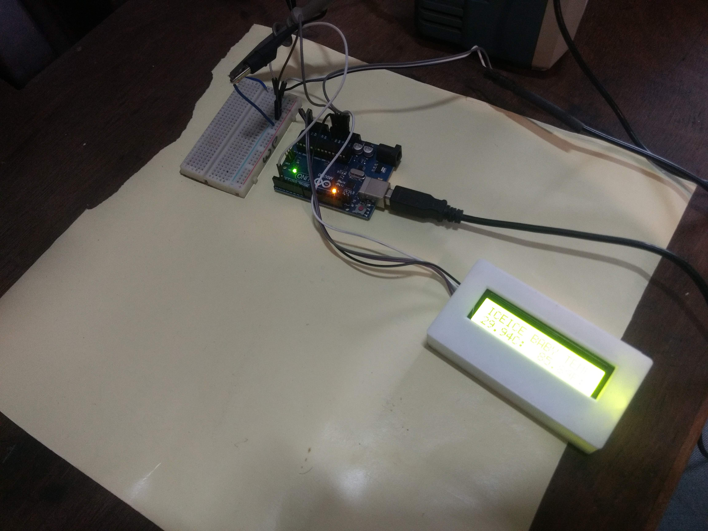
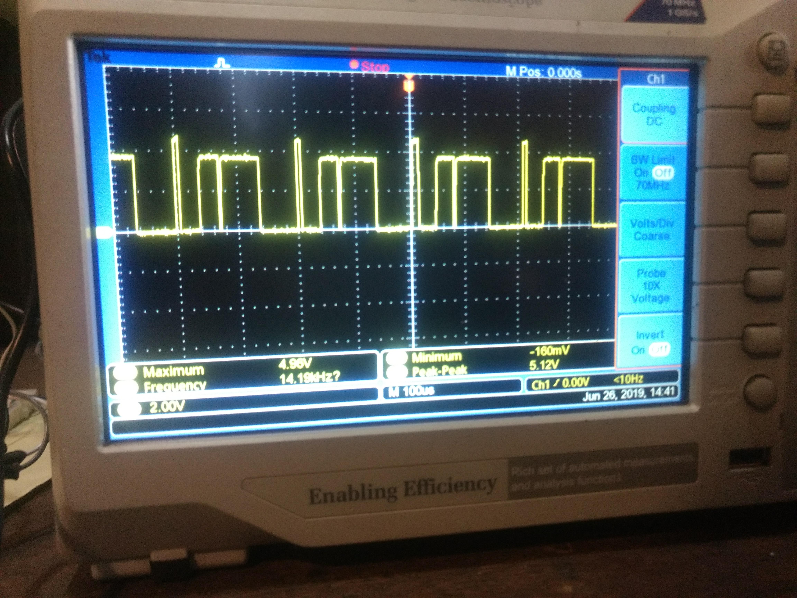
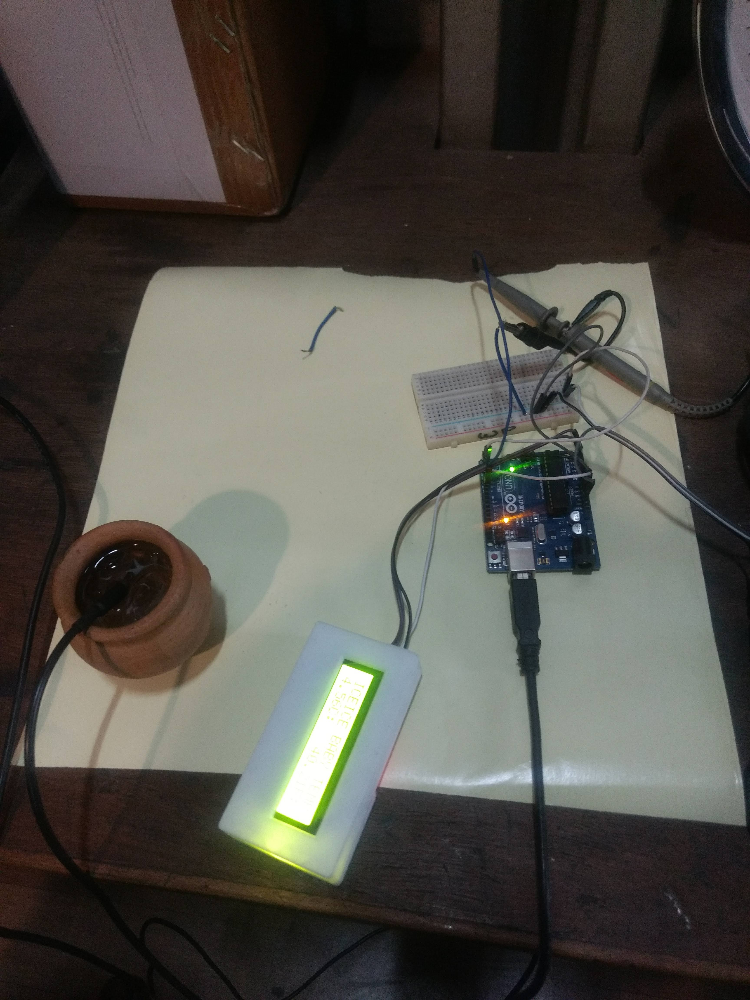
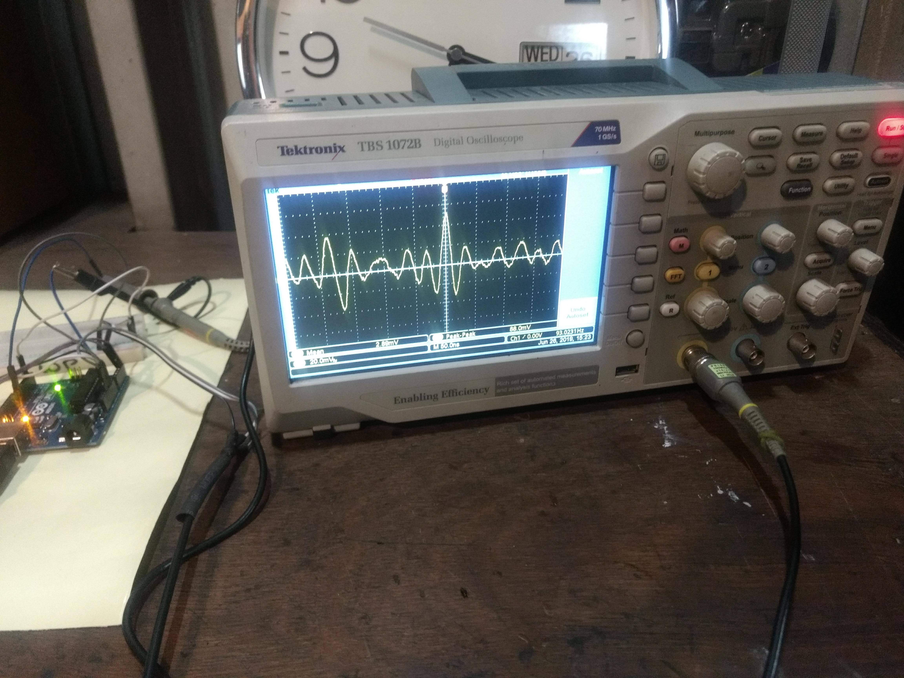
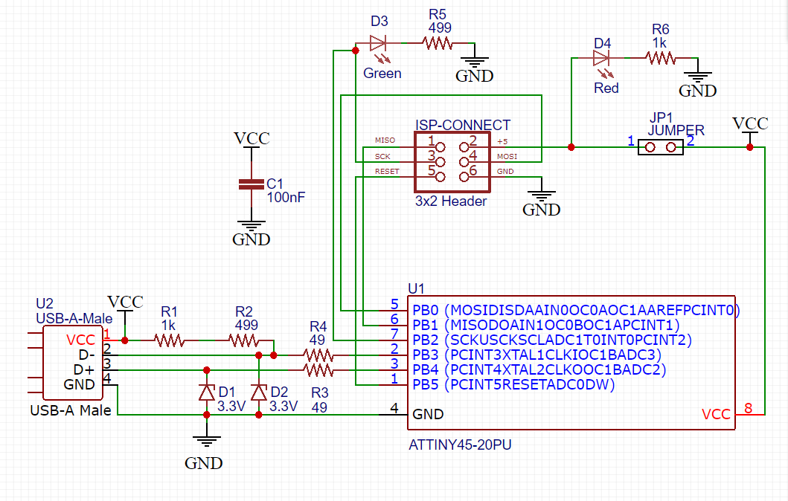

# 7. The Design of Electronic Circuits

Goal(s):

- Group project:
  - Use the test equipment in your lab to observe the operation of a microcontroller circuit board

- Individual project:
  - Redraw the echo hello-world board, add (at least) a button and LED (with current-limiting resistor) check the design rules, make it, and test it
  - For extra credit: simulate its operation

## Observing operation of a Microcontroller board

For this exercise, I used the Oscilloscope and Regulated Power Supply devices to observe the Operation of an Arduino UNO R3 for the basic understanding of how to analyze boards.

Also, the final sensors used in the project, namely, Temperature sensor as input and LCD Screen as Output were also measured using the same fundamentals.

- We used an Arduino UNO R3 Board for studying the ATMEG328P-U Microcontroller on the board.
- After Powering up the board with the RPS Cable at 5 Volts and 1 Ampere
- We

- We use the probe to study the temperature signals being sent to the board

- We use the probe to study the output signals going from the board to the LCD

## PCB Design

Being a complete newbie at Electronics design and having only seen and heard about board design, there was a huge learning curve for me, but with the help of in-house members and some advice from the local Gurus, there was a itemized series of steps that had to be followed for the completion of the assignment.

- Designing a circuit board
- Observing Board operation
- Redrawing the Hello World board

## Designing a Circuit board

For this exercise, I used an online tool called [EasyEDA](https://easyeda.com/) which was really simple to use for both schematic and circuit development.

Since Electronics was new to me, I decided to relook at the FabISP Circuit and redesign it for ease of soldering and operation

Using EasyEDA was as easy as its name suggested

I started by making the Schematic of a target board (FabISP Tiny Star in this case) which took close to 3 hours as I had to figure out all the key elements of the software.

Preparation of the final PCB was as simple as clicking the Convert to PCB Option and getting the traces autorouted as per the internal algorithms for the circuit.

## Redrawing the Hello World Board

From the [archive](http://fabacademy.org/2018/docs/FabAcademy-Tutorials/week6_electronic_design/eagle_english.html) page, I took the schematic and modified it for the ATTiny85 chip as per the following [tutorial](http://archive.fabacademy.org/archives/2017/fablabsingapore/students/172/exercise06.html) to redraw the board from scratch and by using the design software used earlier.

The steps and links are detailed below

PCB production was using the Laser Engraving-Chemical etch process

## Useful links

- [Fab Archive](http://jekyll.org)
- [Google](http://google.com)
- [Markdown](https://en.wikipedia.org/wiki/Markdown)
- [Lady ADA](http://www.ladyada.net/learn/avr/)
- [Arduino ISP](https://create.arduino.cc/projecthub/arjun/programming-attiny85-with-arduino-uno-afb829)