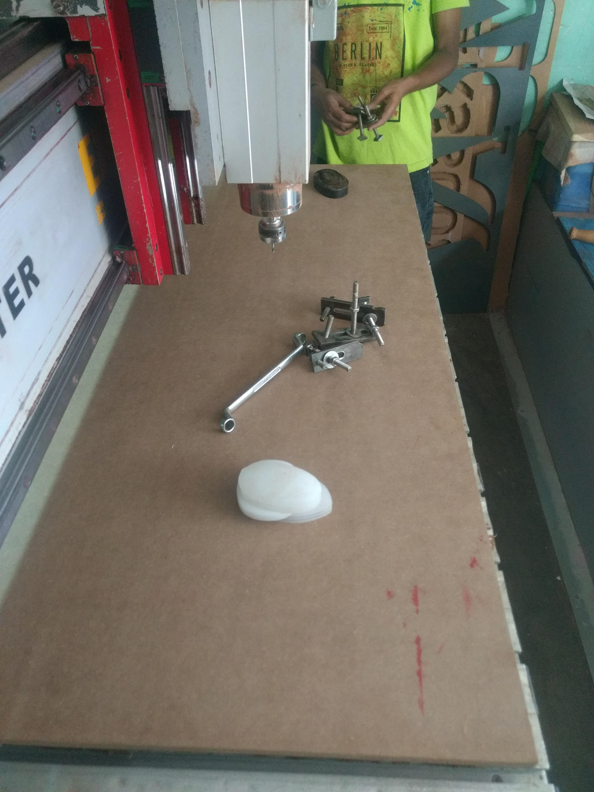
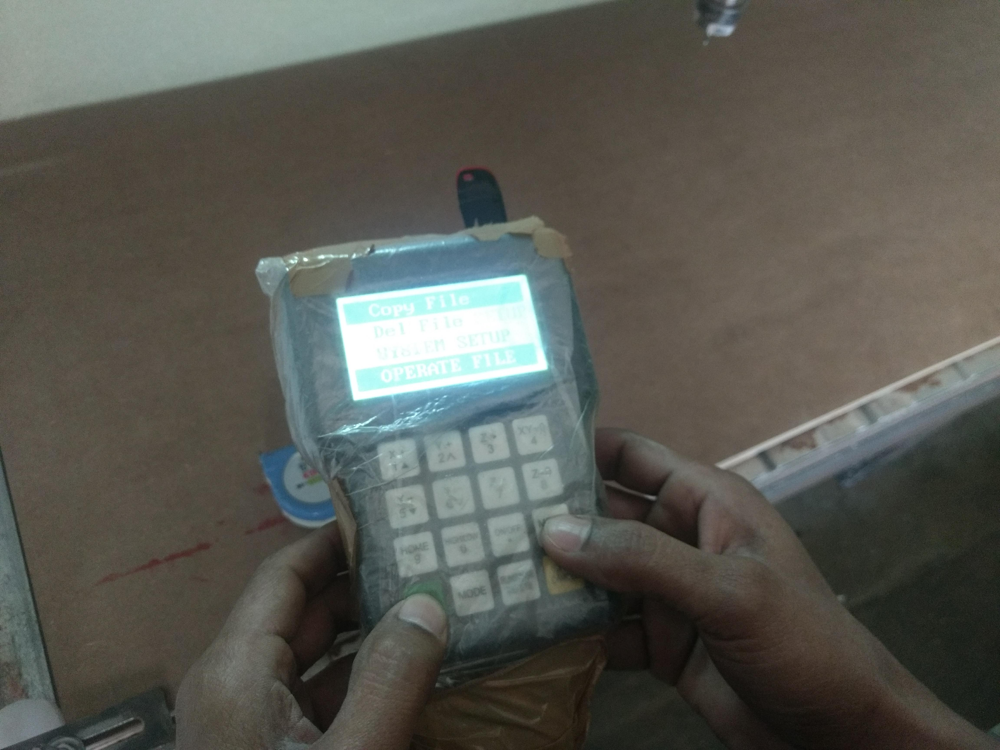

# 8. Computer controlled machining

Goal(s):

- Group assignment
  - Test runout, alignment, speeds, feeds, and toolpaths for your machine

- Individual assignment
  - Make (design + mill + assemble) something big

## Folding Furniture Research

This project is inspired, in part, by the [Expand Furniture](https://expandfurniture.com/) phenomenon where very large scale furniture is squeezed into very small spaces and the Design Rules are centered around Modularity, Simplicty and Parametric design features.

### Sketch and Design

The following design was commissioned by a DJ who wanted a common stand for all his audio and electronic sound mixing equipment

- The final model taken for converting into a Corel Draw Design for cutting.

- Corel Draw design

- ArtCAM was used for the final conversion to Gcode to get it cut out.

Due to the Size limitations of the CNC Router used at our Lab, the bed size is only 600x600mm, the final design was taken to a partner location for cutting on a large format CNC Router (4 feet by 8 feet). The specs of the mcahine are given below

Machine design Specs

Excitech CNC Router (China) - 4x8 feet

Italian Spindle for Routing

RPM: 18000

Using ArtCAM, the final design was converted to Gcode and cut on the machine. The steps are denoted in the Gallery.

The model was cut on the 4x8 large format CNC Machine

Final Object image is presented here

Material used for this project: 12mm Brown MDF Board
Software used for the project: [ArtCAM](https://buildyourcnc.com/Item/CAM-SOFTWARE-artcam) (old version)

## Useful Files

- [Expand Furniture](https://expandfurniture.com/)
- [Final Model](../images/week08/Alkesh.skp))

## Gallery

- Material Preparation

      

- Machine Preparation

     

- Machine Operation

           

- Assembly

                     
