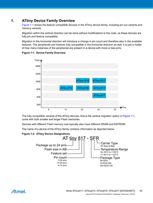
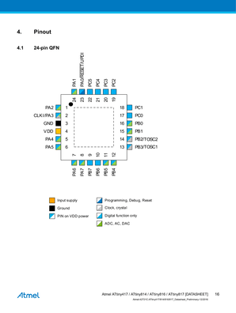
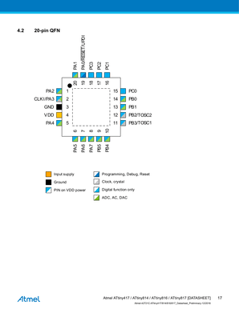
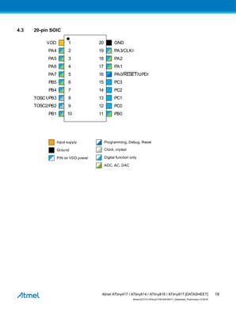
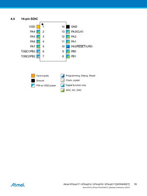
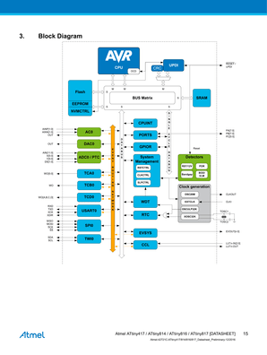
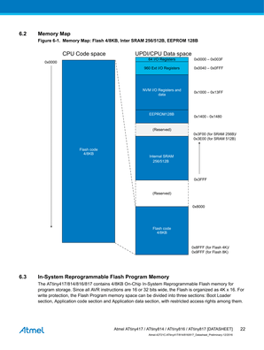
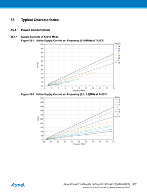
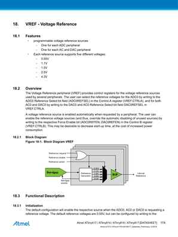

# 9. The Programming of Embedded Microcontrollers

Goal(s):

- Individual assignment:
  - Read a microcontroller data sheet
  - Program your board to do something (with as many different programming languages and programming environments as possible)

- Group assignment:
  - To compare the performance and development workflows for other architectures

## Individual Assignment

### Data Sheet

The Microcontroller Data sheet selected for this assignment were the ones that have been specified and used so far for the Electronics assignments

[Datasheet 1](http://ww1.microchip.com/downloads/en/DeviceDoc/Atmel-42721C-AVR-ATtiny417-814-816-817-Datasheet_Complete.pdf "Opens in a new tab") 

The main points to be noted for the ATTiny Class Microcontrollers were:

1. Name and Designation of components 

2. IC Pinout diagram    

3. Block Diagrams 

4. Memory Maps 

5. Characteristic Power consumptions 

6. Voltage References 

The selected datasheet was quite comprehensive in detail and requires much more time before it can fully be understood, but for the sake of projects selected.

### Board Programming

This was a pretty straight forward task and the steps are detailed below.

1. Drawing of schematic on Eagle

2. Generation o

3. 

4. 

5. 

6. 

7. 

8. 

## Group Assignment

For the Group assignment, the goal was to compare performance and development workflows for different architectures

From the archive data, there are 5 major Atmel Architectures that are commonly used in the course

- ATtiny44
- ATtiny45
- ATtiny84
- ATtiny85
- ATMega328P

## Useful links

- [PDF Extraction](https://tools.pdf24.org/en/extract-images)