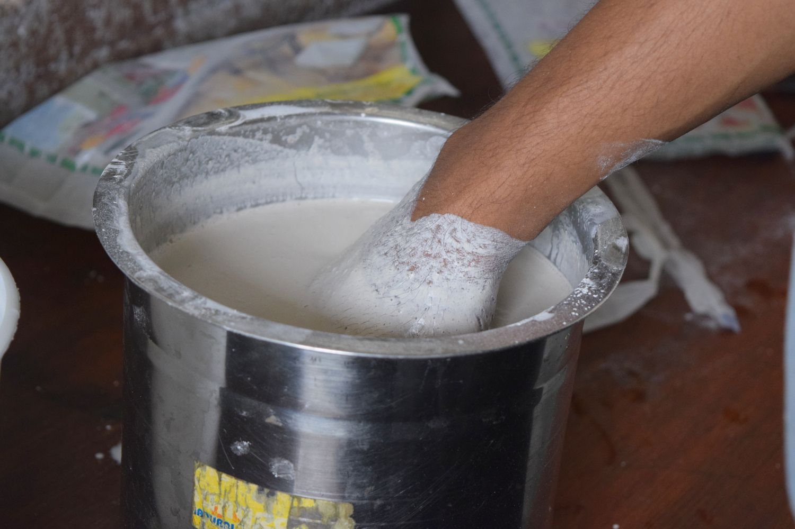

# 10. Molding and casting

Goal(s):

- Group assignment:
  - Review the safety data sheets for each of your molding and casting materials, then make and compare test casts with each of them.

- Individual assignment:
  - Design a mold around the stock and tooling that you'll be using, mill it (rough cut + (at least) three-axis finish cut), and use it to cast parts

## Materials and Research

For the molding and casting assignment, the following materials were selected for the test casts.

- Hot Glue           - [Data Sheet](https://multimedia.3m.com/mws/mediawebserver?mwsId=SSSSSuUn_zu8l00x4x_xNxmvPv70k17zHvu9lxtD7SSSSSS--)
- Silicone Caulking  - [Data Sheet](https://www.farnell.com/datasheets/1799211.pdf)
- Plaster of Paris   - [Data Sheet](https://mypages.valdosta.edu/tauyeno/chemicals/Plaster%20of%20Paris.pdf)
- Paraffin Wax       - [Data Sheet](https://birite.com/wp-content/uploads/msds/2014/690506-nnn.pdf)

Oomoo is actually the recommended silicone rubber, but our stock of Ooomoo had dried up due to a long duration of storage in less-than-ideal conditions. So, in a pinch, I selected Silicone caulk with to get the comparison

## Test Cast

The test cast with all the selected materials are shown below, with a brief summary of the materials

Hot Glue 

Silicone Caulk

Plaster Of Paris

Paraffin Wax

## Final Mold

For the final mold, I prepared a 2-part egg-shell mold on Google Sketchup (since Easter was coming up) and I used this mold to cast Plaster of paris into egg shells for encasing different materials.

Final print

This lesson was a great exploration into how 3D printing can be used as a tool for miniature production scales especially where industrial production and scales cannot apply economically.

Using 3D printable models to make thermoplastic molds for food based materials works exceptionally well during holidays and cultural festivals for customizing and enlivening the festival moods.

### Milling Mold

As per my updates, I also milled the same egg shape using MDF Board in our small-format CNC Router to use as a cast for the Molding exercise.

Download my files here

[Easter (Sketchup File)](
[Easter STL](

<iframe width="640" height="480" src="https://sketchfab.com/models/95f7a21e74a347a6936369d1e136f414/embed" frameborder="0" allow="autoplay; fullscreen; vr" mozallowfullscreen="true" webkitallowfullscreen="true"></iframe>

    <a href="https://sketchfab.com/3d-models/easter-egg-shells-95f7a21e74a347a6936369d1e136f414?utm_medium=embed&utm_source=website&utm_campaign=share-popup" target="_blank" style="font-weight: bold; color: #1CAAD9;">Easter Egg Shells</a>
    by <a href="https://sketchfab.com/gichardromes?utm_medium=embed&utm_source=website&utm_campaign=share-popup" target="_blank" style="font-weight: bold; color: #1CAAD9;">gichardromes</a>
    on <a href="https://sketchfab.com?utm_medium=embed&utm_source=website&utm_campaign=share-popup" target="_blank" style="font-weight: bold; color: #1CAAD9;">Sketchfab</a>

## Useful links

- [Jekyll](http://jekyll.org)
- [Google Sketchup](https://www.sketchup.com/)
- [Markdown](https://en.wikipedia.org/wiki/Markdown)
- [Image Resizing](https://imageresize.org/bulk-resize)

## Gallery

                              
