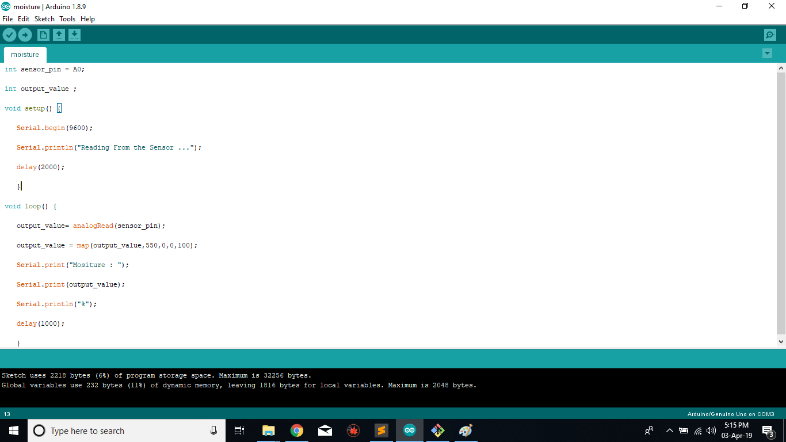
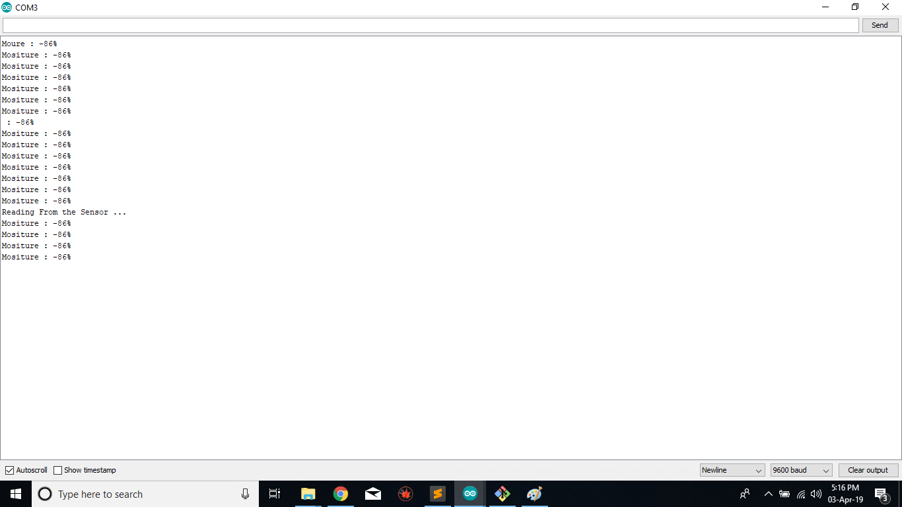
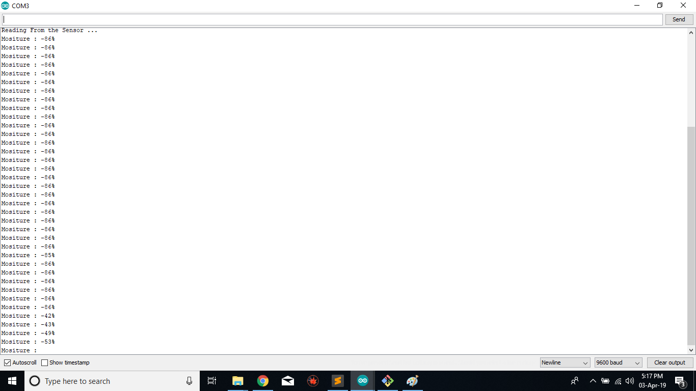
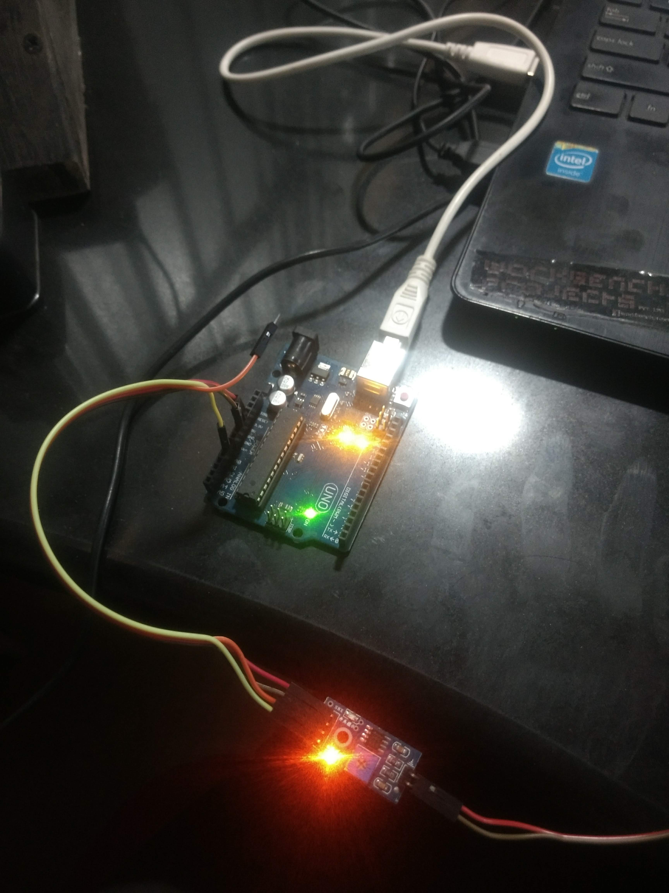
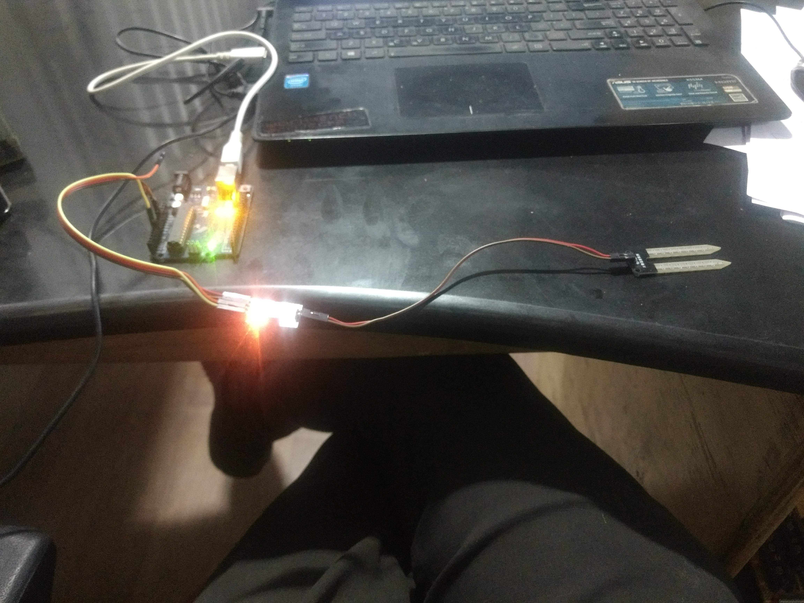

# 11. Input devices

Goal(s):

- Group assignment:
  - Probe an input device's analog levels and digital signals

- Individual assignment:
  - Measure something: add a sensor to a microcontroller board that you have designed and read it

## Research

For this assignment, I initially used an Arduino Uno to test the input to a Temperature Sensor which I will be using in my Final project.

Due to my limitation in being able to assimilate Electronics I have initially used commercial Arduino Boards.

Later as my progress into electronics progressed, I used the Satshakit by Danielle

I connected the temperature probe as an input device and measured its output using the serial monitor itself

## Codes used

Code used

```
#include <OneWire.h>
#include <DallasTemperature.h>
OneWire  ds(2);

void setup() {
 Serial.print("Temperature.....");
 delay(3000);

Serial.print("Starting.....");
delay(3000);
}
void loop() {
  byte i;
byte present = 0;
byte type_s;
byte data[12];
byte addr[8];
float celsius, fahrenheit;
if ( !ds.search(addr)) {
ds.reset_search();
delay(250);
return;
}
for ( i = 0; i < 8; i++) {
}
if (OneWire::crc8(addr, 7) != addr[7]) {
return;
}
// the first ROM byte indicates which chip
switch (addr[0]) {
case 0x10:
type_s = 1;
break;
case 0x28:
type_s = 0;
break;
case 0x22:
type_s = 0;
break;
default:
return;
}
ds.reset();
ds.select(addr);
ds.write(0x44, 1);        // start conversion, with parasite power on at the end
delay(1000);     // maybe 750ms is enough, maybe not
// we might do a ds.depower() here, but the reset will take care of it.
present = ds.reset();
ds.select(addr);
ds.write(0xBE);         // Read Scratchpad
for ( i = 0; i < 9; i++) {           // we need 9 bytes
data[i] = ds.read();
}
int16_t raw = (data[1] << 8) | data[0];
if (type_s) {
raw = raw << 3; // 9 bit resolution default
if (data[7] == 0x10) {
// "count remain" gives full 12 bit resolution
raw = (raw & 0xFFF0) + 12 - data[6];
}
} else {
byte cfg = (data[4] & 0x60);
// at lower res, the low bits are undefined, so let's zero them
if (cfg == 0x00) raw = raw & ~7;  // 9 bit resolution, 93.75 ms
else if (cfg == 0x20) raw = raw & ~3; // 10 bit res, 187.5 ms
else if (cfg == 0x40) raw = raw & ~1; // 11 bit res, 375 ms
//// default is 12 bit resolution, 750 ms conversion time
}
celsius = (float)raw / 16.0;
fahrenheit = celsius * 1.8 + 32.0;
  delay(300);
  Serial.print("ICEICE BABY TEMP");
  Serial.print(celsius);
  Serial.print("C:");
  Serial.print(fahrenheit);
  Serial.print("F:");
  }
```

## Output

## Useful links

- [Jekyll](http://jekyll.org)
- [Google](http://google.com)
- [Markdown](https://en.wikipedia.org/wiki/Markdown)


## Gallery










