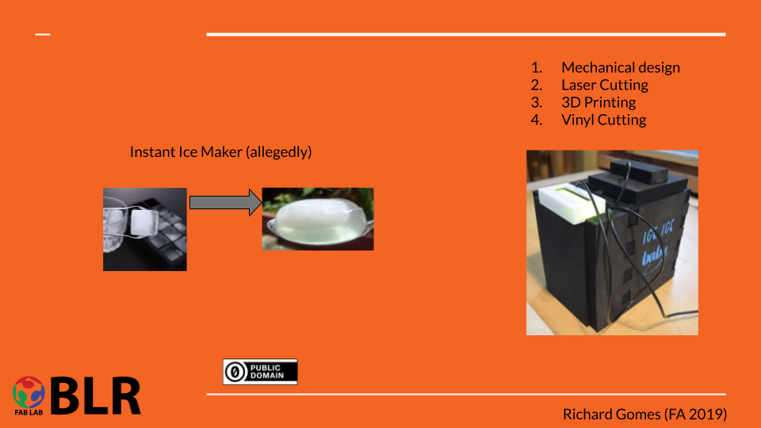

# 13. Applications and implications

Goal(s):

Propose a final project masterpiece that integrates the range of units covered, answering:
         What will it do?
         Who's done what beforehand?
         What will you design?
         What materials and components will be used?
         Where will come from?
         How much will they cost?
         What parts and systems will be made?
         What processes will be used?
         What questions need to be answered?
         How will it be evaluated?

## Masterpiece

## What will it do?

The Ice machine is a sub-system within a larger system that is expected to freeze upto 10 Ice Spheres from a chemical salt solution within 1 hour using purely electronic processes or augmented chemical and electronic processes.

## Who's done what beforehand?

The UK-based Startup Ooho Water ([NotPLA](https://www.notpla.com/products/)) first debuted the edible water Bubble as an entry to the Lexus Design Awards in 2013. The recipe is listed as a Creative Commons Property and the process is open-source and common in Molecular Gastronomy Circles

## What will you design?

The purpose of this project is to design a standalone machine, which when incorporated with the open-source recipe, should be able to dispense the Water Bubbles on demand for programs, events and other places where the bubble may be required.

## What materials and components will be used?

The materials and components to be used in this project are to be fabricated within the FabLab for the first prototype and then designed for manufacture by external manufacturing entities.

Food Grade Silicone Molds
Custom PCB and Board design for control based on the Atmel Processors

## Where will it come from?

First iteration - Fabricated within the Fablab
Product iterations - Fabricated with external partners or with the member community

## How much will they cost?

The entire project has been budgeted at INR 15,000 / USD 200 for the first prototype and all subsequent iterations as per the market rates for design and manufacture, estimated below INR 50,000 / USD 700.

## What parts and systems will be made?

The parts and systems to be made are listed below
- Mixing Subsystem
- Freezing Subsystem
- Pumping and flow Subsystem
- Quality control system throughout
- Dispensing mechanism

## Materials and Components

| item                          | quantity | name                                | description                                                              | cost (INR) | provider       | Remarks |
|-------------------------------|----------|-------------------------------------|--------------------------------------------------------------------------|------------|----------------|---------|
| EVA Foam                      | 10 sq ft | Insulating Foam                     | Used for creating the heat insulating freezing chamber for ice formation | 2000       | Local Supplier |         |
| Power Supply                  | 1        | Regulated Power Supply              | For providing a stable power supply to the Peltier modules               | 2000       | Fablab         |         |
| Temperature Sensor            | 1        | DHT322 Sensor                       | For measuring the completion of the reaction                             | 250        | Fablab         |         |
| LCD Screen                    | 1        | LCD Screen with I2C module attached | For display of the Status of the reaction                                | 400        | Fablab         |         |
| Peltier Module with Heat Sink | 3        | 72 W Peltier module with Heatsink   | For allowing for instant freezing of a given salt solution               | 900        | Fablab         |         |
| Custom PCB / Satshakit        | 2        | Fabbable Arduino Open Source        | For allowing independent control of one or more elements                 | 300        | FabLab         |         |
| Other                         | NA       | Materials and Supplies              | For Supporting the production of the machine                             | 200        | Local Supplier |         |
| Total                         |          |                                     |                                                                          | 6150       | Fablab         |         |

Each of these subsystema can be developed using the same workflows that have been used in FabAcademy and can be linked up to form a larger system.

## What processes will be used?

The goal is to integrate all the processes used in Fab Academy 2019 in the making of a prototype portable freezing machine that can dispense water bubbles on demand

## What questions need to be answered?

The questions that need to be answered are

- Is there a valid need for a scaled up process for this project?
- Is this just a novelty that can gain views?
- Is a purely mechanical or chemical process without any electronic sensing or control valid for this project to proceed?

## How will it be evaluated?

The success of the machine is its own evaulation in being able to dispense liquid filled bubbles of water encased in a clear skin.

In all honesty, the process can be completed in a purely mechanical fashion using liquid nitrogen ad specialty molds made for this process and will require only a bit of unskilled labour to dispense the bubbles after using the right formula for the recipe to work.

The evaluation will be then to understand if the process can be or should be automated so as to effect drop in price or rise in price for the quantity of water bubbles dispensed.

## Useful links

- [Ooho](https://www.designboom.com/technology/skipping-rocks-lab-ooho-edible-water-bottle-04-12-2017/)