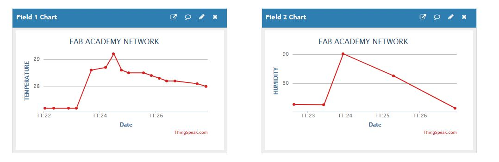

# 14. Networking and communications

Goal(s):

- individual assignment:
      design, build, and connect wired or wireless node(s) with network or bus addresses

- group assignment:
      send a message between two projects
      
## Research

To get started with this assignment, I went through the tutorials of [ThingSpeak](https://thingspeak.com/) and explored all the options for the creation of simple IoT communication for my project.

The goal will be to get the machine to relay data from the sensors directly via tha internet to a Mobile phone inteface from where the progress of the operation can be monitored.

Sensors used:

Water Proof Temperature sensor

4 Pin LCD Display

ESP8266 WiFi module for relaying information.

I used the DIY Arduino for the testing of the sensors and relaying thhe data to the ThingSpeak App

## Thingspeak

## Output

## Useful links

- [Jekyll](http://jekyll.org)
- [Google](http://google.com)
- [ThingSpeak](https://thingspeak.com/)