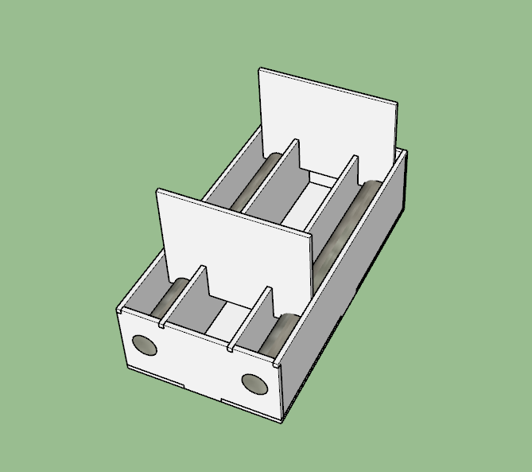

# 15. Mechanical design

Goal(s):

group assignment
   - design a machine that includes mechanism + actuation + automation
   - build the mechanical parts and operate it manually
   - document the group project and your individual contribution
   
   
## Concept

Since I am the only student in this cycle, this was not a group assignment and not coming from a Mechanical Engineering background, this was quite a tough task. As far as the machine building task went, I decided to design the tentative mechanism that I plan to use in my final version of the machine and keep upgrading the skills as I proceed in the project.

The software of coice for this exercise has been Google Sketchup Make 17 from the longest time (2016) as this version of the software has been the easiest to work with requiring the least technical knowledge to begin.

The basic idea of the mechanism is depicted as
- Flash freezing a salt solution at -14 Degrees Celcius for 60 seconds allowing for
- External ice skin to be formed around the liquid before opening the mold and 
- Releasing the Ice ball into the cooking solution allowing for the skin to form around the ice as it defrosts

Taking inspiration form the Earlier Fab Projects: [Machines That Make](http://mtm.cba.mit.edu/machines/science/), the following model was designed using Sketchup

and built with Laser cutting

## Useful links

- [Jekyll](http://jekyll.org)
- [Google](http://google.com)
- [Markdown](https://en.wikipedia.org/wiki/Markdown)
