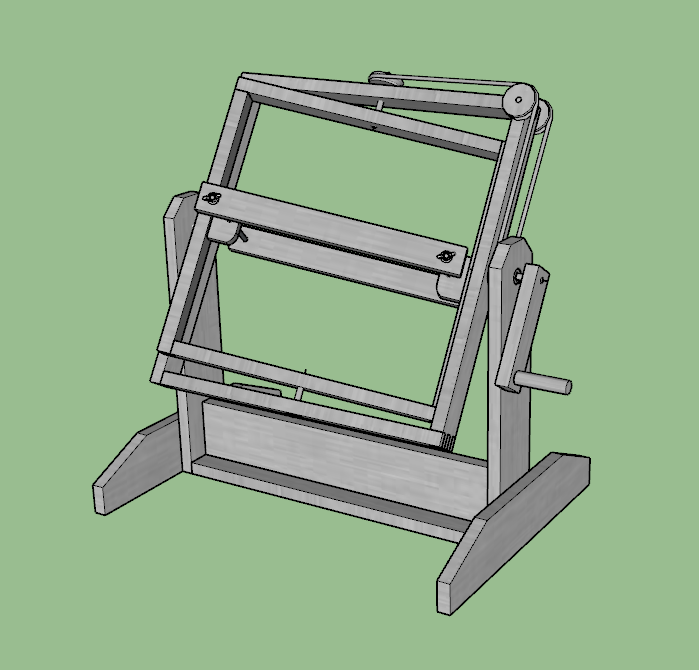

# 17. Machine design

Goal(s):

group assignment
   - actuate and automate your machine
   - document the group project and your individual contribution

## Research

Due to the limitation of mechanical experience for the design assignment, and as covered in the Mechanical design assigment, we decided to build and automate a rotocasting machine.

The build of the rotocasting machine was covered in the Mechanical design assignment and can be accessed [here]. The rotocasting machine was then actuated using a drill machine to find out what would be the force required to digitally rotate the mechanism to get the required output

## Rotocasting Machine Design

The machine design was taken from the following video

<iframe width="560" height="315" src="https://www.youtube.com/embed/R-6U9mOG9Ps" frameborder="0" allow="accelerometer; autoplay; encrypted-media; gyroscope; picture-in-picture" allowfullscreen></iframe>

The software used was Google Sketchup 2017 and the final result was after designing.

## Working of the machine

<iframe width="560" height="315" src="https://www.youtube.com/embed/oWus1sSKjPI" frameborder="0" allow="accelerometer; autoplay; encrypted-media; gyroscope; picture-in-picture" allowfullscreen></iframe>

Filling the empty bottle with white paint to allow for clear visualization of the coverage of the paint within the machine.

<iframe width="560" height="315" src="https://www.youtube.com/embed/8sG9djNYoh4" frameborder="0" allow="accelerometer; autoplay; encrypted-media; gyroscope; picture-in-picture" allowfullscreen></iframe>

The time for rotation varies as per the type of material used and the curing time and hardening time for the 

<iframe width="560" height="315" src="https://www.youtube.com/embed/M2cNdHnjD60" frameborder="0" allow="accelerometer; autoplay; encrypted-media; gyroscope; picture-in-picture" allowfullscreen></iframe>

<iframe width="640" height="480" src="https://sketchfab.com/models/5f6094f6c21049869b0ecc09feb43e42/embed" frameborder="0" allow="autoplay; fullscreen; vr" mozallowfullscreen="true" webkitallowfullscreen="true"></iframe>

    <a href="https://sketchfab.com/3d-models/roto-5f6094f6c21049869b0ecc09feb43e42?utm_medium=embed&utm_source=website&utm_campaign=share-popup" target="_blank" style="font-weight: bold; color: #1CAAD9;">Roto</a>
    by <a href="https://sketchfab.com/gichardromes?utm_medium=embed&utm_source=website&utm_campaign=share-popup" target="_blank" style="font-weight: bold; color: #1CAAD9;">gichardromes</a>
    on <a href="https://sketchfab.com?utm_medium=embed&utm_source=website&utm_campaign=share-popup" target="_blank" style="font-weight: bold; color: #1CAAD9;">Sketchfab</a>

## Useful links

- [Sketch Fab Model](../images/week17/Roto.STL)
- [Google](http://google.com)
- [Markdown](https://en.wikipedia.org/wiki/Markdown)