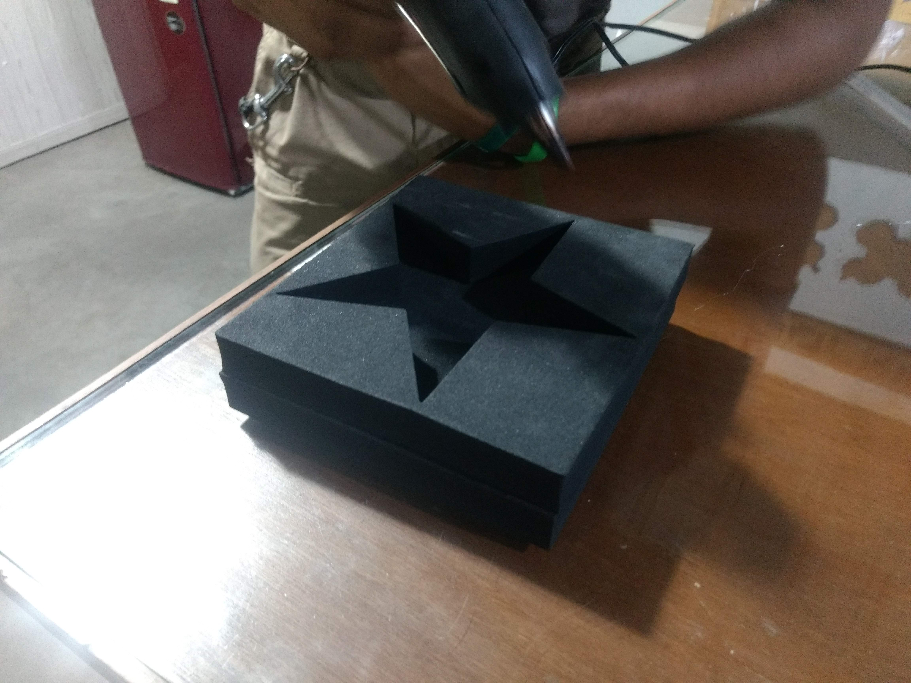
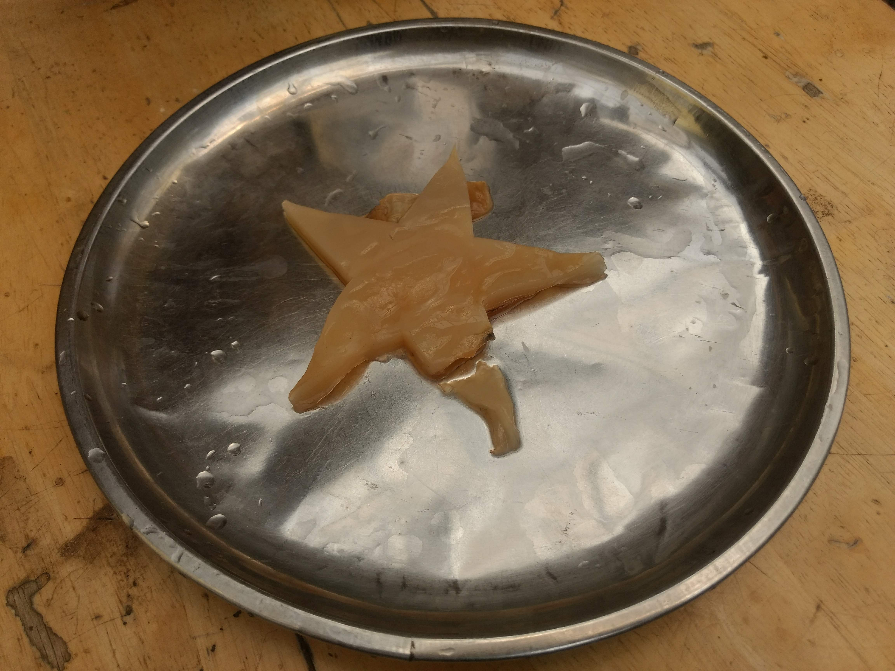

# 18. Wildcard week

Goal(s):

Design and produce something with a digital fabrication process (incorporating computer-aided design and manufacturing) not covered in another assignment, documenting the requirements that your assignment meets, and including everything necessary to reproduce it. Possibilities include (but are not limited to) composites, textiles, biotechnology, robotics, folding, and cooking.

## Research into Vegan Leather

For the Wild Card week, I selected the topic of Bio-fabrication to implement as for this project.

We are looking a the first sample of a Bio-cellulose material grown using a digital fabrication process and bioprocess.

The material used is called a SCOBY (Symbiotic Culture of Bacteria and Yeast) and is quite popular in the preparation of a drink called [Kombucha](https://en.wikipedia.org/wiki/Kombucha) and it is growing into a digital shape as per the process used.

The first step was to understand the biology and growth pattern for the SCOBY and I referenced the following video by [Thought Emporium](https://www.youtube.com/channel/UCV5vCi3jPJdURZwAOO_FNfQ)

<iframe width="560" height="315" src="https://www.youtube.com/embed/Ds8ZFzOwGeI" frameborder="0" allow="accelerometer; autoplay; encrypted-media; gyroscope; picture-in-picture" allowfullscreen></iframe>

From the video, it was clear that the material takes the shape of the container that it grows in and the main goal for this exercise was to design and shape a custom container using a Digital Fabrication process. The steps are shown below

- The design of the container
- The fabrication of the container
- The finishing of the container
- The growth medium

## Container Design

Wanting to keep the design simple as this is a time intensive process, I decided to keep a simple design that would be easy to waterproof given that the process would involve holding a liquid over an extended period of time (over a month or more).

I decide to use EVA Foam as this is an abundant mmaterials at our Fablab and I will beusing this material for my final project as well as it is a good insulator and cuts well in the laser.

## Container Fabrication

After cutting out the basic shapes in the laser cutter, we used Hot Glue to bind the edges and allowed for excess silicone to leak out over the edges to ensure a waterproof seal.

## Container finishing

After the containers were complete, we filled up water in the Cavities and left them overnight to check for any leaks, leaks were sealed with hot glue.

## Growth Medium

After designing, the raw material was added to the chamber and the reaction was allowed to take place and left in place for the duration of the experiment.

Due to the slow growth rate of the material, the progess is followed slowly and is available below. There should be more updates as the course progresses

As the SCOBY took time in growing, this is what we ended up with after 1 month of growth.

There was a break in the material on one side due to the delicate nature of the material. We need to be ccareful in removing it.

## Learning

There is a huge possibility for custom designed material of this material which is called Vegan Leather and we plan to grow larger sizes of this material to test as a form of alternative to plastic, leather and other biooigcally produced composite materials. This is a larger project in the context of the Fablab.

The Files are available below

## Useful links

- [Jekyll](http://jekyll.org)
- [Google](http://google.com)
- [Markdown](https://en.wikipedia.org/wiki/Markdown)