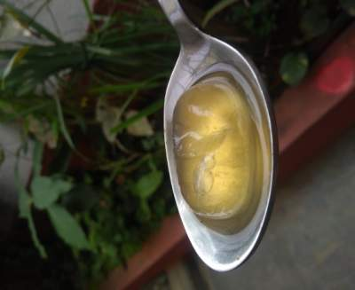
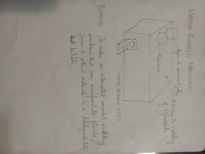

# Richard Gomes

## [FabLab Bangalore](https://www.fablabs.io/labs/workbenchprojects "First one in Bangalore")

## About me

I am a biologist by passion and eccentric [Maker](https://workbenchprojects.com/our-team/ "Eccentric") who prefers working on unconventional and unknown ideas over tried and tested ones. 

Bachelors in Engineering Biotechnology from Manipal Institute of Technology.

Work experience in areas ranging from

- Beer brewing at Kingfisher Beer
- Downstream processing of menthol
- Production of biofuel from micro-algae. 
- Digital Fabrication and Training

## My Project Idea

As part of FabLab Bangalore, there are a lot of projects that are applicable in the Indian Context, specific to Fablab Bangalore and the projects that we are trying to accomplish with respect to "Responsible Innovation"

- Smart WiFi Menu card
- Smart Shopfloor Safety Glove
- Smart Dog Collar
- Smart Universal Brewer
- Water Bubble Machine

As part of the Fab Academy Program, I have selected the Water Bubble Machine as the Final project.

Photo credits: The Bangalore Mirror

##Concept Sketch(es)

### Wifi Menu Card

 

### Smart Shopfloor Safety Glove

 

### Smart Dog Collar

 

### Smart Universal Brewer

 

### Water Bubble Machine

 

More details expected in the [Project](./project(s)/final-project/) Tab
