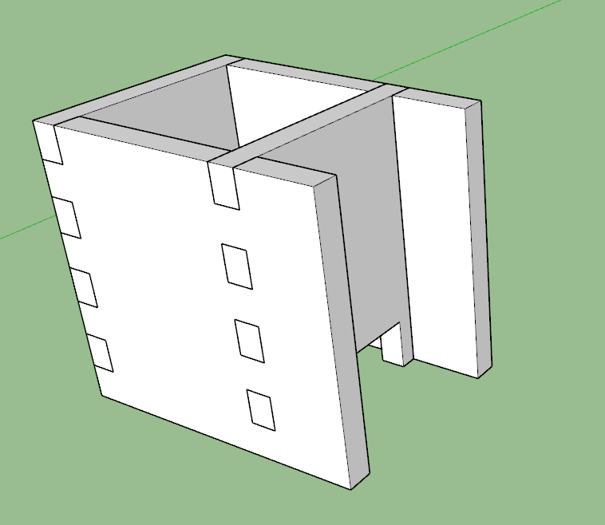
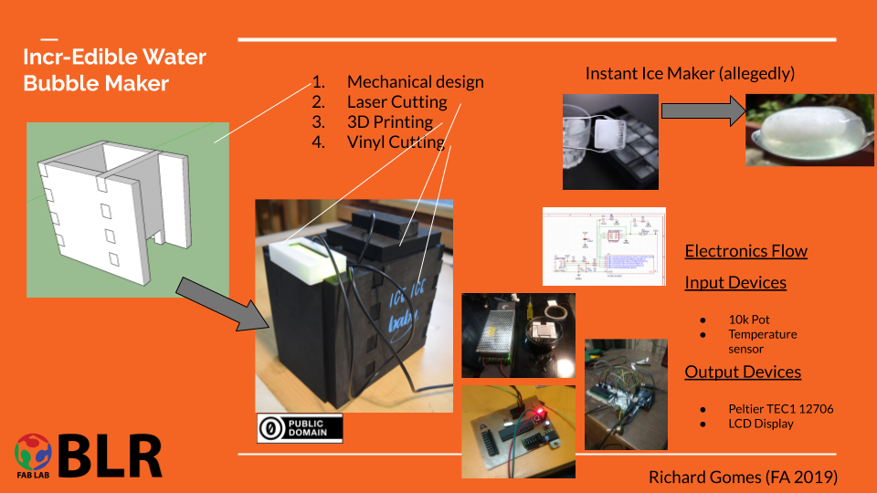

# Final Project

This pages documents tha journey taken from understanding the individual tasks of Fab Academy and integrating it for the Final project.

## Concepts

From the starting page of the project, the idea for the final project was inspired in part by Ooho and in part by the public interest and demand for such a product to be available in the market from events to hotels 

The expectation of the final product is an edible / biodegradable water bubble that can be used to change the way we look at single use packaging.

<Image of Ooho Bubble> <Image of WP Bubble>

Since this product is quite know in niche cirlse in the Molecoular Gastronomy scene, the process for making this and the machine consequentlyt was taken as a reverse engineering exercize

<Reverse Spherifcation process> Video

The Process was broken down in to the follwoing steps

1. Prepare a flavorful liquid base. Begin with a flavorful liquid of the desired consistency. ...
2. Prepare a spherification bath. Prepare either a Sphere Magic bath or an alginate bath. ...
3. Remove any air. ...
4. Organize your work area. ...
5. Form spheres. ...
6. Stir and strain. ...
7. Store or serve.

In the scale up of this process, the most time consuming and rate limiting step in this process was obviously,

Forming of the Spheres by freezing the salt solution

So, using the principle of Spiral development, I chose this step to focus on in the Fab Academy Course

For this machine, we broke down the machine subsystems to 7 steps as per the process:

a. Mixer for the Chemical Base
b. Mixer for the Alginate Bath
c. Vaccuum for the removal of air
d. Pumping of Base into pre-formed molds
e. Cryo-freezing of Base into desired shape
f. Release of base into alginate bath for cooking
g. Washing and serving of finished bubbles

The initial render for the machine is as depicted below



After several iterations, I looked at the various options for the small scale automation of kitchen fnctions and decided to go with the function of a Sandwich Maker but with the primary function reversed, but realised that there would still be much work involved to make it possible.

A brief search online for such machine reveealed that a similar product exists called the [Japanese Ice Ball Press](https://www.barproducts.com/interchangeable-japanese-ice-ball-maker) and it still requires a block of ice and about 30 seconds to generate the ice sphere.

Given my limitation in machine design and electronics for this project, I decided to make a simple project and only integrate sensing into the project to start with and build capability in to the project as we progressed.

I used a DS18B20 Water Proof Temperature Sensor Probe as the input device and a 4 pin LCD Screen for output device with th following code used to sense the temperature of the chamber and display it outside on the screen


```
#include <LiquidCrystal_I2C.h>
#include <OneWire.h>
#include <DallasTemperature.h>
LiquidCrystal_I2C lcd(0x27,20,4);
OneWire  ds(2);


void setup() {
 lcd.init();
 lcd.backlight();
 lcd.print("Temperature.....");
delay(3000);
lcd.clear();
lcd.print("Starting.....");
delay(3000);
}
void loop() {
  byte i;
byte present = 0;
byte type_s;
byte data[12];
byte addr[8];
float celsius, fahrenheit;
if ( !ds.search(addr)) {
ds.reset_search();
delay(250);
return;
}
for ( i = 0; i < 8; i++) {
}
if (OneWire::crc8(addr, 7) != addr[7]) {
return;
}
// the first ROM byte indicates which chip
switch (addr[0]) {
case 0x10:
type_s = 1;
break;
case 0x28:
type_s = 0;
break;
case 0x22:
type_s = 0;
break;
default:
return;
}
```

For the Materials for the outer body, the material selected was 3/4 inch [EVA Foam](http://www.zotefoams.com/wp-content/uploads/2015/12/Evazote%23U00ae-EV50.pdf) due to its excellent insulation capabilities

The Assignment topics covered here for the project is listed step wise:

### Machine Design And Mechanical Design

Machine Design - Limited to basic mechanical functions only

### Computer Controlled Cutting

Cutting of the outer EVA Foam Body only

### 3D Printing

Printing the casing for the electronics

### Electronics Workflow

Design


### Networking and Communication


### Interface and Application Programming


### Molding and Casting


### Basic model

The bare bones of this project is detailed in the Presentation slide and video shown below



<iframe width="560" height="315" src="https://www.youtube.com/embed/GSupla9MWGU" frameborder="0" allow="accelerometer; autoplay; encrypted-media; gyroscope; picture-in-picture" allowfullscreen></iframe>

### Bill of Materials

EVA Foam and Construction materials - INR 500
SMPS (12V, 10A) - INR 2000
Large Heat Sink - INR 250
Peltier Module (12V, 6A) - INR 250
Temperature Sensor - INR 150
LCD Sensor - INR 400
DIY Arduino - INR 300
Satshakit - INR 300
Misc - INR 500

Total Costing - INR 4650 (approx. USD 70)


## Useful links

- https://www.chefsteps.com/activities/reverse-spherification
- https://www.notpla.com/
- https://en.wikipedia.org/wiki/Spiral_model